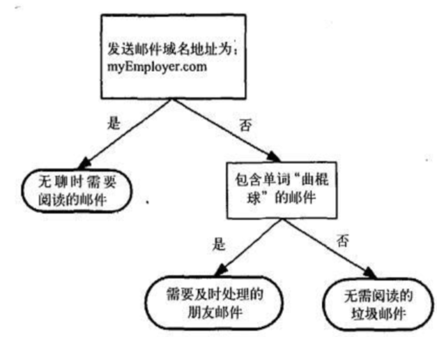

# 决策树

>基于树的结构进行决策，在分类问题中，表示基于特征对实例进行分类的过程，可以认为是if-then的集合，也可以认为是定义在特征空间与类空间上的条件概率分布。

## 步骤

- 特征选择
- 决策树的生成
- 决策树的修剪。

>用决策树分类：从根节点开始，对实例的某一特征进行测试，根据测试结果将实例分配到其子节点，此时每个子节点对应着该特征的一个取值，如此递归的对实例进行测试并分配，直到到达叶节点，最后将实例分到叶节点的类中[机器学习实战](https://blog.csdn.net/jiaoyangwm/article/details/79525237)


```r
library(knitr)

```


这是一个决策树流程图，正方形代表判断模块，椭圆代表终止模块，表示已经得出结论，可以终止运行，左右箭头叫做分支。

上节介绍的k-近邻算法可以完成很多分类任务，但是其最大的缺点是无法给出数据的内在含义，决策树的优势在于数据形式非常容易理解。

## 构造决策树

决策树学习的算法通常是一个递归地选择最优特征，并根据该特征对训练数据进行分割，使得各个子数据集有一个最好的分类的过程。这一过程对应着对特征空间的划分，也对应着决策树的构建。

1.开始：构建根节点，将所有训练数据都放在根节点，选择一个最优特征，按着这一特征将训练数据集分割成子集，使得各个子集有一个在当前条件下最好的分类。

2.如果这些子集已经能够被基本正确分类，那么构建叶节点，并将这些子集分到所对应的叶节点去。

3.如果还有子集不能够被正确的分类，那么就对这些子集选择新的最优特征，继续对其进行分割，构建相应的节点，如果递归进行，直至所有训练数据子集被基本正确的分类，或者没有合适的特征为止。

4.每个子集都被分到叶节点上，即都有了明确的类，这样就生成了一颗决策树。

## ID3


划分数据集的大原则是：将无序数据变得更加有序，但是各种方法都有各自的优缺点，信息论是量化处理信息的分支科学，在划分数据集前后信息发生的变化称为信息增益，获得信息增益最高的特征就是最好的选择，所以必须先学习如何计算信息增益，集合信息的度量方式称为香农熵，或者简称熵。

### 信息熵

**熵定义为信息的期望值**

信息熵表示随机变量的不确定性，也就是随机变量的复杂度，因此信息熵越小，表示数据集X的纯度越大。

$H(X)=-\sum_{x \in \mathcal{X}} p(x) \log p(x)$

### 条件熵
定义为X给定条件下，Y的条件概率分布的熵对X的数学期望
通俗的讲，就是条件概率分布之下
设有随机变量（X,Y），其联合概率分布为

$p\left(X=x_{i}, Y=y_{i}\right)=p_{i}, i=1,2, \ldots, n, j=1,2, \ldots, m$
条件熵H(Y|X)表示在已知随机变量X的条件下随机变量Y的不确定性。随机变量X给定的条件下随机变量Y的条件熵H(Y|X)

$\begin{aligned} H(Y | X) &=\sum_{x \in X} p(x) H(Y | X=x) \\ &=-\sum_{x \in X} p(x) \sum_{y \in Y} p(y | x) \log p(y | x) \\ &=-\sum_{x \in X} \sum_{y \in Y} p(x, y) \log p(y | x) \end{aligned}$

在给定某个数（某个变量为某个值）的情况下，另一个变量的熵是多少，变量的不确定性是多少？

因为条件熵中X也是一个变量，意思是在一个变量X的条件下（变量X的每个值都会取），另一个变量Y熵对X的期望。

**经验条件熵就是在某一条件约束下的经验熵。**

### 信息增益
是信息熵-条件熵
代表了在一个条件下，信息复杂度（不确定性）减少的程度

信息增益是相对于特征而言的。所以，特征A对训练数据集D的信息增益g(D,A)，定义为集合D的经验熵H(D)与特征A给定条件下D的经验条件熵H(D|A)之差，

$g(D, A)=H(D)-H(D | A)$

一般地，熵H(D)与条件熵H(D|A)之差成为互信息(mutual information)。决策树学习中的信息增益等价于训练数据集中类与特征的互信息。

信息增益值的大小相对于训练数据集而言的，并没有绝对意义，在分类问题困难时，也就是说在训练数据集经验熵大的时候，信息增益值会偏大，反之信息增益值会偏小，使用信息增益比可以对这个问题进行校正，这是特征选择的另一个标准。


因此信息增益越大表示信息复杂度减少的愈多，在选择特征分类的时候，信息增益越大的特征优先考虑为父节点

### ID3算法缺陷

ID3 没有剪枝策略，容易过拟合；
信息增益准则对可取值数目较多的特征有所偏好，类似“编号”的特征其信息增益接近于 1；
只能用于处理离散分布的特征；
没有考虑缺失值。
只适用于二分类

## C4.5

C4.5 算法最大的特点是克服了 ID3 对特征数目的偏重这一缺点，引入**信息增益率**来作为分类标准
基于信息增益率准则选择最优分割属性的算法
信息增益比率通过引入一个被称作分裂信息(Split information)的项来惩罚取值较多的属性。

### 信息增益率(比)
信息增益比：特征A对训练数据集D的信息增益比$g_R(D,A)$定义为其信息增益$g(D,A)$与训练数据集D的经验熵之比：

$$
 g _ { R } ( D , A ) = \frac { g ( D , A ) } { H ( D ) } 
$$
信息增益率对可取值较少的特征有所偏好（分母越小，整体越大），因此 C4.5 并不是直接用增益率最大的特征进行划分，而是使用一个启发式方法：先从候选划分特征中找到信息增益高于平均值的特征，再从中选择增益率最高的

## CART

CART是一棵二叉树，采用二元切分法，每次把数据切成两份，分别进入左子树、右子树。而且每个非叶子节点都有两个孩子，所以CART的叶子节点比非叶子多1。相比ID3和C4.5，CART应用要多一些，既可以用于分类也可以用于回归。CART分类时，使用基尼指数（Gini）来选择最好的数据分割的特征，gini描述的是纯度，与信息熵的含义相似。CART中每一次迭代都会降低GINI系数。

### 基尼系数

$$\operatorname{Gini}(D)=1-\sum_{i=0}^{n}\left(\frac{D i}{D}\right)^{2}$$

$$\operatorname{Gini}(D | A)=\sum_{i=0}^{n} \frac{D i}{D} \operatorname{Gini}(D i)$$

基尼指数可以用来度量任何不均匀分布，是介于 0~1 之间的数，0 是完全相等，1 是完全不相等

## ID3、C4.5、CART的区别

这三个是非常著名的决策树算法。简单粗暴来说，ID3 使用信息增益作为选择特征的准则；C4.5 使用信息增益比作为选择特征的准则；CART 使用 Gini 指数作为选择特征的准则。

### ID3
熵表示的是数据中包含的信息量大小。熵越小，数据的纯度越高，也就是说数据越趋于一致，这是我们希望的划分之后每个子节点的样子。

信息增益 = 划分前熵 - 划分后熵。信息增益越大，则意味着使用属性 a 来进行划分所获得的 “纯度提升” 越大 **。也就是说，用属性 a 来划分训练集，得到的结果中纯度比较高。

ID3 仅仅适用于二分类问题。ID3 仅仅能够处理离散属性。

### C4.5

C4.5 克服了 ID3 仅仅能够处理离散属性的问题，以及信息增益偏向选择取值较多特征的问题，使用信息增益比来选择特征。信息增益比 = 信息增益 / 划分前熵 选择信息增益比最大的作为最优特征。

C4.5 处理连续特征是先将特征取值排序，以连续两个值中间值作为划分标准。尝试每一种划分，并计算修正后的信息增益，选择信息增益最大的分裂点作为该属性的分裂点。

### CART

CART 与 ID3，C4.5 不同之处在于 CART 生成的树必须是二叉树。也就是说，无论是回归还是分类问题，无论特征是离散的还是连续的，无论属性取值有多个还是两个，内部节点只能根据属性值进行二分。

CART 的全称是分类与回归树。从这个名字中就应该知道，CART 既可以用于分类问题，也可以用于回归问题。

回归树中，使用平方误差最小化准则来选择特征并进行划分。每一个叶子节点给出的预测值，是划分到该叶子节点的所有样本目标值的均值，这样只是在给定划分的情况下最小化了平方误差。

要确定最优化分，还需要遍历所有属性，以及其所有的取值来分别尝试划分并计算在此种划分情况下的最小平方误差，选取最小的作为此次划分的依据。由于回归树生成使用平方误差最小化准则，所以又叫做最小二乘回归树。

分类树种，使用 Gini 指数最小化准则来选择特征并进行划分；

Gini 指数表示集合的不确定性，或者是不纯度。基尼指数越大，集合不确定性越高，不纯度也越大。这一点和熵类似。另一种理解基尼指数的思路是，基尼指数是为了最小化误分类的概率。

### 信息增益 vs 信息增益比

之所以引入了信息增益比，是由于信息增益的一个缺点。那就是：信息增益总是偏向于选择取值较多的属性。信息增益比在此基础上增加了一个罚项，解决了这个问题。

### Gini 指数 vs 熵

既然这两个都可以表示数据的不确定性，不纯度。那么这两个有什么区别那？

Gini 指数的计算不需要对数运算，更加高效；
Gini 指数更偏向于连续属性，熵更偏向于离散属性。

## 剪枝

决策树算法很容易过拟合（overfitting），剪枝算法就是用来防止决策树过拟合，提高泛华性能的方法。

剪枝分为预剪枝与后剪枝。

**预剪枝**是指在决策树的生成过程中，对每个节点在划分前先进行评估，若当前的划分不能带来泛化性能的提升，则停止划分，并将当前节点标记为叶节点。

**后剪枝**是指先从训练集生成一颗完整的决策树，然后自底向上对非叶节点进行考察，若将该节点对应的子树替换为叶节点，能带来泛化性能的提升，则将该子树替换为叶节点。

那么怎么来判断是否带来泛化性能的提升呢？最简单的就是留出法，即预留一部分数据作为验证集来进行性能评估。

## 复现

[csdn的一个小demo](https://blog.csdn.net/jiaoyangwm/article/details/79525237)

可以方便我复习语法和代码:smile:

```python
from math import log
import operator
from matplotlib.font_manager import FontProperties
import matplotlib.pyplot as plt
"""
函数说明：计算给定数据集的经验熵（香农熵）
Parameters：
    dataSet：数据集
Returns：
    shannonEnt：经验熵
Modify：
    2018-03-12

"""
def calcShannonEnt(dataSet):
    #返回数据集行数
    numEntries=len(dataSet)
    #保存每个标签（label）出现次数的字典
    labelCounts={}
    #对每组特征向量进行统计
    for featVec in dataSet:
        currentLabel=featVec[-1]                     #提取标签信息
        if currentLabel not in labelCounts.keys():   #如果标签没有放入统计次数的字典，添加进去
            labelCounts[currentLabel]=0
        labelCounts[currentLabel]+=1                 #label计数

    shannonEnt=0.0                                   #经验熵
    #计算经验熵
    for key in labelCounts:
        prob=float(labelCounts[key])/numEntries      #选择该标签的概率
        shannonEnt-=prob*log(prob,2)                 #利用公式计算
    return shannonEnt                                #返回经验熵

"""
函数说明：创建测试数据集
Parameters：无
Returns：
    dataSet：数据集
    labels：分类属性
Modify：
    2018-03-13

"""
def createDataSet():
    # 数据集
    dataSet=[[0, 0, 0, 0, 'no'],
            [0, 0, 0, 1, 'no'],
            [0, 1, 0, 1, 'yes'],
            [0, 1, 1, 0, 'yes'],
            [0, 0, 0, 0, 'no'],
            [1, 0, 0, 0, 'no'],
            [1, 0, 0, 1, 'no'],
            [1, 1, 1, 1, 'yes'],
            [1, 0, 1, 2, 'yes'],
            [1, 0, 1, 2, 'yes'],
            [2, 0, 1, 2, 'yes'],
            [2, 0, 1, 1, 'yes'],
            [2, 1, 0, 1, 'yes'],
            [2, 1, 0, 2, 'yes'],
            [2, 0, 0, 0, 'no']]
    #分类属性
    labels=['年龄','有工作','有自己的房子','信贷情况']
    #返回数据集和分类属性
    return dataSet,labels

"""
函数说明：按照给定特征划分数据集

Parameters：
    dataSet:待划分的数据集
    axis：划分数据集的特征
    value：需要返回的特征值
Returns：
    无
Modify：
    2018-03-13

"""
def splitDataSet(dataSet,axis,value):
    #创建返回的数据集列表
    retDataSet=[]
    #遍历数据集
    for featVec in dataSet:
        if featVec[axis]==value:
            #去掉axis特征
            reduceFeatVec=featVec[:axis]
            #将符合条件的添加到返回的数据集
            reduceFeatVec.extend(featVec[axis+1:])
            retDataSet.append(reduceFeatVec)
    #返回划分后的数据集
    return retDataSet

"""
函数说明：计算给定数据集的经验熵（香农熵）
Parameters：
    dataSet：数据集
Returns：
    shannonEnt：信息增益最大特征的索引值
Modify：
    2018-03-13

"""


def chooseBestFeatureToSplit(dataSet):
    #特征数量
    numFeatures = len(dataSet[0]) - 1
    #计数数据集的香农熵
    baseEntropy = calcShannonEnt(dataSet)
    #信息增益
    bestInfoGain = 0.0
    #最优特征的索引值
    bestFeature = -1
    #遍历所有特征
    for i in range(numFeatures):
        # 获取dataSet的第i个所有特征
        featList = [example[i] for example in dataSet]
        #创建set集合{}，元素不可重复
        uniqueVals = set(featList)
        #经验条件熵
        newEntropy = 0.0
        #计算信息增益
        for value in uniqueVals:
            #subDataSet划分后的子集
            subDataSet = splitDataSet(dataSet, i, value)
            #计算子集的概率
            prob = len(subDataSet) / float(len(dataSet))
            #根据公式计算经验条件熵
            newEntropy += prob * calcShannonEnt((subDataSet))
        #信息增益
        infoGain = baseEntropy - newEntropy
        #打印每个特征的信息增益
        print("第%d个特征的增益为%.3f" % (i, infoGain))
        #计算信息增益
        if (infoGain > bestInfoGain):
            #更新信息增益，找到最大的信息增益
            bestInfoGain = infoGain
            #记录信息增益最大的特征的索引值
            bestFeature = i
            #返回信息增益最大特征的索引值
    return bestFeature

"""
函数说明：统计classList中出现次数最多的元素（类标签）
Parameters：
    classList：类标签列表
Returns：
    sortedClassCount[0][0]：出现次数最多的元素（类标签）
Modify：
    2018-03-13

"""
def majorityCnt(classList):
    classCount={}
    #统计classList中每个元素出现的次数
    for vote in classList:
        if vote not in classCount.keys():
            classCount[vote]=0
            classCount[vote]+=1
        #根据字典的值降序排列
        sortedClassCount=sorted(classCount.items(),key=operator.itemgetter(1),reverse=True)
        return sortedClassCount[0][0]

"""
函数说明：创建决策树

Parameters:
    dataSet：训练数据集
    labels：分类属性标签
    featLabels：存储选择的最优特征标签
Returns：
    myTree：决策树
Modify：
    2018-03-13

"""
def createTree(dataSet,labels,featLabels):
    #取分类标签（是否放贷：yes or no）
    classList=[example[-1] for example in dataSet]
    #如果类别完全相同，则停止继续划分
    if classList.count(classList[0])==len(classList):
        return classList[0]
    #遍历完所有特征时返回出现次数最多的类标签
    if len(dataSet[0])==1:
        return majorityCnt(classList)
    #选择最优特征
    bestFeat=chooseBestFeatureToSplit(dataSet)
    #最优特征的标签
    bestFeatLabel=labels[bestFeat]
    featLabels.append(bestFeatLabel)
    #根据最优特征的标签生成树
    myTree={bestFeatLabel:{}}
    #删除已经使用的特征标签
    del(labels[bestFeat])
    #得到训练集中所有最优特征的属性值
    featValues=[example[bestFeat] for example in dataSet]
    #去掉重复的属性值
    uniqueVls=set(featValues)
    #遍历特征，创建决策树
    for value in uniqueVls:
        myTree[bestFeatLabel][value]=createTree(splitDataSet(dataSet,bestFeat,value),
                                               labels,featLabels)
    return myTree

"""
函数说明：获取决策树叶子节点的数目

Parameters：
    myTree：决策树
Returns：
    numLeafs：决策树的叶子节点的数目
Modify：
    2018-03-13

"""

def getNumLeafs(myTree):
    numLeafs=0
    firstStr=next(iter(myTree))
    secondDict=myTree[firstStr]
    for key in secondDict.keys():
        if type(secondDict[key]).__name__=='dict':
            numLeafs+=getNumLeafs(secondDict[key])
        else: numLeafs+=1
    return numLeafs

"""
函数说明:获取决策树的层数

Parameters:
    myTree:决策树
Returns:
    maxDepth:决策树的层数

Modify:
    2018-03-13
"""
def getTreeDepth(myTree):
    maxDepth = 0                                                #初始化决策树深度
    firstStr = next(iter(myTree))                                #python3中myTree.keys()返回的是dict_keys,不在是list,所以不能使用myTree.keys()[0]的方法获取结点属性，可以使用list(myTree.keys())[0]
    secondDict = myTree[firstStr]                                #获取下一个字典
    for key in secondDict.keys():
        if type(secondDict[key]).__name__=='dict':                #测试该结点是否为字典，如果不是字典，代表此结点为叶子结点
            thisDepth = 1 + getTreeDepth(secondDict[key])
        else:   thisDepth = 1
        if thisDepth > maxDepth: maxDepth = thisDepth            #更新层数
    return maxDepth

"""
函数说明:绘制结点

Parameters:
    nodeTxt - 结点名
    centerPt - 文本位置
    parentPt - 标注的箭头位置
    nodeType - 结点格式
Returns:
    无
Modify:
    2018-03-13
"""
def plotNode(nodeTxt, centerPt, parentPt, nodeType):
    arrow_args = dict(arrowstyle="<-")                                            #定义箭头格式
    font = FontProperties(fname=r"c:\windows\fonts\simsun.ttc", size=14)        #设置中文字体
    createPlot.ax1.annotate(nodeTxt, xy=parentPt,  xycoords='axes fraction',    #绘制结点
        xytext=centerPt, textcoords='axes fraction',
        va="center", ha="center", bbox=nodeType, arrowprops=arrow_args, FontProperties=font)

"""
函数说明:标注有向边属性值

Parameters:
    cntrPt、parentPt - 用于计算标注位置
    txtString - 标注的内容
Returns:
    无
Modify:
    2018-03-13
"""
def plotMidText(cntrPt, parentPt, txtString):
    xMid = (parentPt[0]-cntrPt[0])/2.0 + cntrPt[0]                                            #计算标注位置
    yMid = (parentPt[1]-cntrPt[1])/2.0 + cntrPt[1]
    createPlot.ax1.text(xMid, yMid, txtString, va="center", ha="center", rotation=30)

"""
函数说明:绘制决策树

Parameters:
    myTree - 决策树(字典)
    parentPt - 标注的内容
    nodeTxt - 结点名
Returns:
    无
Modify:
    2018-03-13
"""
def plotTree(myTree, parentPt, nodeTxt):
    decisionNode = dict(boxstyle="sawtooth", fc="0.8")                                        #设置结点格式
    leafNode = dict(boxstyle="round4", fc="0.8")                                            #设置叶结点格式
    numLeafs = getNumLeafs(myTree)                                                          #获取决策树叶结点数目，决定了树的宽度
    depth = getTreeDepth(myTree)                                                            #获取决策树层数
    firstStr = next(iter(myTree))                                                            #下个字典
    cntrPt = (plotTree.xOff + (1.0 + float(numLeafs))/2.0/plotTree.totalW, plotTree.yOff)    #中心位置
    plotMidText(cntrPt, parentPt, nodeTxt)                                                    #标注有向边属性值
    plotNode(firstStr, cntrPt, parentPt, decisionNode)                                        #绘制结点
    secondDict = myTree[firstStr]                                                            #下一个字典，也就是继续绘制子结点
    plotTree.yOff = plotTree.yOff - 1.0/plotTree.totalD                                        #y偏移
    for key in secondDict.keys():
        if type(secondDict[key]).__name__=='dict':                                            #测试该结点是否为字典，如果不是字典，代表此结点为叶子结点
            plotTree(secondDict[key],cntrPt,str(key))                                        #不是叶结点，递归调用继续绘制
        else:                                                                                #如果是叶结点，绘制叶结点，并标注有向边属性值
            plotTree.xOff = plotTree.xOff + 1.0/plotTree.totalW
            plotNode(secondDict[key], (plotTree.xOff, plotTree.yOff), cntrPt, leafNode)
            plotMidText((plotTree.xOff, plotTree.yOff), cntrPt, str(key))
    plotTree.yOff = plotTree.yOff + 1.0/plotTree.totalD

"""
函数说明:创建绘制面板

Parameters:
    inTree - 决策树(字典)
Returns:
    无
Modify:
    2018-03-13
"""
def createPlot(inTree):
    fig = plt.figure(1, facecolor='white')#创建fig
    fig.clf()#清空fig
    axprops = dict(xticks=[], yticks=[])
    createPlot.ax1 = plt.subplot(111, frameon=False, **axprops)#去掉x、y轴
    plotTree.totalW = float(getNumLeafs(inTree))#获取决策树叶结点数目
    plotTree.totalD = float(getTreeDepth(inTree))#获取决策树层数
    plotTree.xOff = -0.5/plotTree.totalW; plotTree.yOff = 1.0#x偏移
    plotTree(inTree, (0.5,1.0), '')#绘制决策树
    plt.show()#显示绘制结果

if __name__ == '__main__':
    dataSet, labels = createDataSet()
    featLabels = []
    myTree = createTree(dataSet, labels, featLabels)
    print(myTree)
    createPlot(myTree)

if __name__=='__main__':
    dataSet,labels=createDataSet()
    featLabels=[]
    myTree=createTree(dataSet,labels,featLabels)
    print(myTree)
```

```r

```


## sklearn.tree.DecisionTreeClassifier

[sklearn.tree.DecisionTreeClassifier](https://scikit-learn.org/stable/modules/generated/sklearn.tree.DecisionTreeClassifier.html#sklearn.tree.DecisionTreeClassifier)

```python
class sklearn.tree.DecisionTreeClassifier(criterion=’gini’, splitter=’best’, max_depth=None, min_samples_split=2, min_samples_leaf=1, min_weight_fraction_leaf=0.0, max_features=None, random_state=None, max_leaf_nodes=None, min_impurity_decrease=0.0, min_impurity_split=None, class_weight=None, presort=False)[source]
```
### 参数说明

**criterion：**特征选择标准，可选参数，默认是gini，可以设置为entropy。gini是基尼不纯度，是将来自集合的某种结果随机应用于某一数据项的预期误差率，是一种基于统计的思想。entropy是香农熵，也就是上篇文章讲过的内容，是一种基于信息论的思想。Sklearn把gini设为默认参数.ID3算法使用的是entropy，CART算法使用的则是gini。

**splitter：**特征划分点选择标准，可选参数，默认是best，可以设置为random。每个结点的选择策略。best参数是根据算法选择最佳的切分特征，例如gini、entropy。random随机的在部分划分点中找局部最优的划分点。默认的**”best”适合样本量不大的时候**，而如果**样本数据量非常大，此时决策树构建推荐”random”**。

**max_features：**划分时考虑的最大特征数，可选参数，默认是None。寻找最佳切分时考虑的最大特征数(n_features为总共的特征数)，有如下6种情况：
- 如果max_features是整型的数，则考虑max_features个特征；

- 如果max_features是浮点型的数，则考虑int(max_features * n_features)个特征；

- 如果max_features设为auto，那么max_features = sqrt(n_features)；

- 如果max_features设为sqrt，那么max_featrues =
sqrt(n_features)，跟auto一样；

- 如果max_features设为log2，那么max_features = log2(n_features)；

- 如果max_features设为None，那么max_features = n_features，也就是所有特征都用。

一般来说，如果样本特征数不多，比如小于50，我们用默认的”None”就可以了，如果特征数非常多，我们可以灵活使用刚才描述的其他取值来控制划分时考虑的最大特征数，以控制决策树的生成时间。

**max_depth：**决策树最大深，可选参数，默认是None。这个参数是这是树的层数的。层数的概念就是，比如在贷款的例子中，决策树的层数是2层。如果这个参数设置为None，那么决策树在建立子树的时候不会限制子树的深度。

一般来说，数据少或者特征少的时候可以不管这个值。或者如果设置了min_samples_slipt参数，那么直到少于min_smaples_split个样本为止。如果模型样本量多，特征也多的情况下，推荐限制这个最大深度，具体的取值取决于数据的分布。常用的可以取值10-100之间。

**min_samples_split：**内部节点再划分所需最小样本数，可选参数，默认是2。这个值限制了子树继续划分的条件。

- 如果min_samples_split为整数，那么在切分内部结点的时候，min_samples_split作为最小的样本数，也就是说，如果样本已经少于min_samples_split个样本，则停止继续切分。如果min_samples_split为浮点数，那么min_samples_split就是一个百分比，ceil(min_samples_split * n_samples)，数是向上取整的。如果样本量不大，不需要管这个值。如果样本量数量级非常大，则推荐增大这个值。

**min_weight_fraction_leaf：**叶子节点最小的样本权重和，可选参数，默认是0。这个值限制了叶子节点所有样本权重和的最小值，如果小于这个值，则会和兄弟节点一起被剪枝。一般来说，如果我们有较多样本有缺失值，或者分类树样本的分布类别偏差很大，就会引入样本权重，这时我们就要注意这个值了。

max_leaf_nodes：最大叶子节点数，可选参数，默认是None。通过限制最大叶子节点数，可以防止过拟合。如果加了限制，算法会建立在最大叶子节点数内最优的决策树。如果特征不多，可以不考虑这个值，但是如果特征分成多的话，可以加以限制，具体的值可以通过交叉验证得到。

class_weight：类别权重，可选参数，默认是None，也可以字典、字典列表、balanced。指定样本各类别的的权重，主要是为了防止训练集某些类别的样本过多，导致训练的决策树过于偏向这些类别。类别的权重可以通过{class_label：weight}这样的格式给出，这里可以自己指定各个样本的权重，或者用balanced，如果使用balanced，则算法会自己计算权重，样本量少的类别所对应的样本权重会高。当然，如果你的样本类别分布没有明显的偏倚，则可以不管这个参数，选择默认的None。

**random_state：**可选参数，默认是None。随机数种子。如果是证书，那么random_state会作为随机数生成器的随机数种子。随机数种子，如果没有设置随机数，随机出来的数与当前系统时间有关，每个时刻都是不同的。如果设置了随机数种子，那么相同随机数种子，不同时刻产生的随机数也是相同的。如果是RandomState instance，那么random_state是随机数生成器。如果为None，则随机数生成器使用np.random。

min_impurity_split：节点划分最小不纯度,可选参数，默认是1e-7。这是个阈值，这个值限制了决策树的增长，如果某节点的不纯度(基尼系数，信息增益，均方差，绝对差)小于这个阈值，则该节点不再生成子节点。即为叶子节点 。

**presort：**数据是否预排序，可选参数，默认为False，这个值是布尔值，默认是False不排序。一般来说，如果样本量少或者限制了一个深度很小的决策树，设置为true可以让划分点选择更加快，决策树建立的更加快。如果样本量太大的话，反而没有什么好处。问题是样本量少的时候，我速度本来就不慢。所以这个值一般懒得理它就可以了。
除了这些参数要注意以外，其他在调参时的注意点有：

- 当样本数量少但是样本特征非常多的时候，决策树很容易过拟合，一般来说，样本数比特征数多一些会比较容易建立健壮的模型.

- 如果样本数量少但是样本特征非常多，在拟合决策树模型前，推荐先做维度规约，比如主成分分析（PCA），特征选择（Losso）或者独立成分分析（ICA）。这样特征的维度会大大减小。再来拟合决策树模型效果会好。

- 推荐多用决策树的可视化，同时先限制决策树的深度，这样可以先观察下生成的决策树里数据的初步拟合情况，然后再决定是否要增加深度。
在训练模型时，注意观察样本的类别情况（主要指分类树），如果类别分布非常不均匀，就要考虑用class_weight来限制模型过于偏向样本多的类别。
决策树的数组使用的是numpy的float32类型，如果训练数据不是这样的格式，算法会先做copy再运行。
- 如果输入的样本矩阵是稀疏的，推荐在拟合前调用csc_matrix稀疏化，在预测前调用csr_matrix稀疏化。

### 练习


