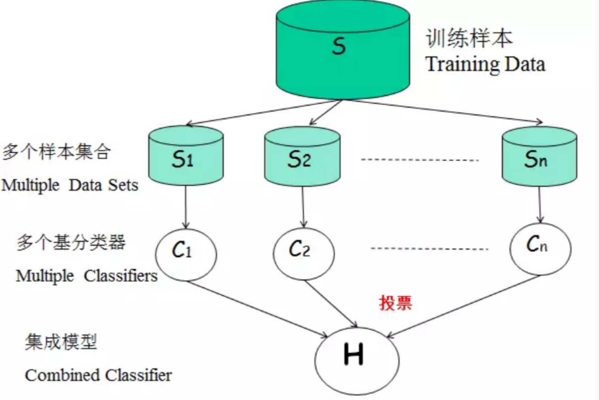

# Bagging

>集成学习通过构建并结合多个学习器来完成学习任务，也叫多分类器系统。

是并行集成学习的代表

集成学习
- 同质集成：同类型的学习器
- 异质集成：不同类型的学习器

>集成学习通过多个学习器进行结合，经常可以获得比单一学习器显著的优越的泛化性能。这对“弱学习器”尤为明显，因此集成学习很多都是针对弱学习器的。


一般来说，集成学习的结果通过“投票产生”及少数服从多数。个体的学习器要有一定的”准确性“即不能太坏，并且具有一定的多样性，即学习器之间具有差异性。但是个体学习器的“准确性”和“多样性”本身就存在冲突
>准确性很高之后要增加多样性就要牺牲准确性，事实上如何产生“好而不同”的个体学习器，正是集成学学习研究的核心。

## 自助采样

有放回的随机，采样，使得下次采样时该样本仍有可能被选中。
[csdn](https://blog.csdn.net/bqw18744018044/article/details/81024520)

>自助法在数据集较小难以划分训练/测试集时很有用


```r
knitr::include_graphics("./figs/05.png")
```


## 包外估计

通过自助采样，初始化数据集D中约有36.8%的样本未出现在采样数据集D'中，于是将D'用作训练集，将随机抽取的样本作为测试集

- 当基学习器是决策树时，可以使用包外样本来辅助剪枝

- 当基学习器是神经网络时，可使用包外样本来辅助早期停止以减小过拟合的风险[简书](https://www.jianshu.com/p/e2db6e4065a0)

## 推导

>bagging通常对分类任务使用简单投票法，对回归任务中使用简单平均法。


**输入**
训练集$D=\left\{\left(\boldsymbol{x}_{1}, y_{1}\right),\left(\boldsymbol{x}_{2}, y_{2}\right), \ldots,\left(\boldsymbol{x}_{m}, y_{m}\right)\right\}$

基学习算法：$\mathcal{L}$

训练次数：$T$

**过程**
for $t=1,2, \dots, T \mathrm{do}$
$h_{t}=\mathfrak{L}\left(D, \mathcal{D}_{b s}\right)$
end for
**输出**
$H(\boldsymbol{x})=\underset{y \in \mathcal{Y}}{\arg \max } \sum_{t=1}^{T} \mathbb{I}\left(h_{t}(\boldsymbol{x})=y\right)$

>若在分类的过程中，出现两个类出现相同的票数，最简单的就是随机选一个。

## 流程图

```r

```


## 实现描述
在scikit-learn中，
参数 max_samples 和 max_features 控制子集的大小（在样本和特征方面）
参数 bootstrap 和 bootstrap_features 控制是否在有或没有替换的情况下绘制样本和特征。

Bagging又叫自助聚集，是一种根据均匀概率分布从数据中重复抽样（有放回）的技术。
每个抽样生成的自助样本集上，训练一个基分类器；对训练过的分类器进行投票，将测试样本指派到得票最高的类中。
每个自助样本集都和原数据一样大
有放回抽样，一些样本可能在同一训练集中出现多次，一些可能被忽略。
[csdn](https://blog.csdn.net/github_35965351/article/details/61193516)

## 评价
Bagging通过降低基分类器的方差，改善了泛化误差
其性能依赖于基分类器的稳定性；如果基分类器不稳定，bagging有助于降低训练数据的随机波动导致的误差；如果稳定，则集成分类器的误差主要由基分类器的偏倚引起
由于每个样本被选中的概率相同，因此bagging并不侧重于训练数据集中的任何特定实例

## BaggingClassifier参数
  
- base_estimator：Object or None。None代表默认是DecisionTree，Object可以指定基估计器（base estimator）。

- n_estimators：int, optional (default=10) 。   要集成的基估计器的个数。

- max_samples： int or float, optional (default=1.0)。决定从x_train抽取去训练基估计器的样本数量。int 代表抽取数量，float代表抽取比例

- max_features : int or float, optional (default=1.0)。决定从x_train抽取去训练基估计器的特征数量。int 代表抽取数量，float代表抽取比例

- bootstrap : boolean, optional (default=True) 决定样本子集的抽样方式（有放回和不放回）

- bootstrap_features : boolean, optional (default=False)决定特征子集的抽样方式（有放回和不放回）

- oob_score : bool 决定是否使用包外估计（out of bag estimate）泛化误差

- warm_start : bool, optional (default=False) true代表

- n_jobs : int, optional (default=1) 

- random_state : int, RandomState instance or None, optional (default=None)。如果int，random_state是随机数生成器使用的种子; 如果RandomState的实例，random_state是随机数生成器; 如果None，则随机数生成器是由np.random使用的RandomState实例。

- verbose : int, optional (default=0) 

## 属性

- estimators_ : list of estimators。The collection of fitted sub-estimators.查看分类器

- estimators_samples_ : list of arrays分类器样本

- estimators_features_ : list of arrays

- oob_score_ : float，使用包外估计这个训练数据集的得分。

- oob_prediction_ : array of shape = [n_samples]。在训练集上用out-of-bag估计计算的预测。 如果n_estimator很小，则可能在抽样过程中数据点不会被忽略。 在这种情况下，oob_prediction_可能包含NaN。

这个栗子是datacamp上面的一个小demo

```python
# Import DecisionTreeClassifier
from sklearn.tree import DecisionTreeClassifier

# Import BaggingClassifier
from sklearn.ensemble import BaggingClassifier

# Instantiate dt
dt = DecisionTreeClassifier(random_state=1)

# Instantiate bc
bc = BaggingClassifier(base_estimator=dt, n_estimators=50, random_state=1)

# Fit bc to the training set
bc.fit(X_train, y_train)

# Predict test set labels
y_pred = bc.predict(X_test)

# Evaluate acc_test
acc_test = accuracy_score(y_test, y_pred)
print('Test set accuracy of bc: {:.2f}'.format(acc_test))

<script.py> output:
    Test set accuracy of bc: 0.71
```

## Out of Bag Evaluation

使用包外估计进行数据集的划分

```python
# Import DecisionTreeClassifier
from sklearn.tree import DecisionTreeClassifier

# Import BaggingClassifier
from sklearn.ensemble import BaggingClassifier

# Instantiate dt
dt = DecisionTreeClassifier(min_samples_leaf=8, random_state=1)

# Instantiate bc
bc = BaggingClassifier(base_estimator=dt, 
                       n_estimators=50,
                       oob_score=True,
                       random_state=1)

# Fit bc to the training set 
bc.fit(X_train, y_train)

# Predict test set labels
y_pred = bc.predict(X_test)

# Evaluate test set accuracy
acc_test = accuracy_score(y_test, y_pred)

# Evaluate OOB accuracy
acc_oob = bc.oob_score_

# Print acc_test and acc_oob
print('Test set accuracy: {:.3f}, OOB accuracy: {:.3f}'.format(acc_test, acc_oob))

<script.py> output:
    Test set accuracy: 0.698, OOB accuracy: 0.704
```

## 集成学习分类

- 个体学习器间存在强依赖关系，必须串行生成的序列化方法

  - boosting
  
- 个体学习器之间不存在强依赖关系，可同时生成的并行化方法

  - bagging和随机森林
  
  >从bias-variance角度讲，bagging主要关注降低方差，因为它不在剪枝决策树，神经网络等易受样本扰动的学习器上效用更为明显。
  
## RF vs Bagging

- 随机森林简单，容易实现随机森林对bagging只是做了小的改动，但是与bagging中基学习器的“多样性”仅通过样本扰动(通过对初始训练集采样)而来不同，随机森林中基学习器的多样性不仅来自样本扰动，还来自属性扰动，这就使得最终集成学习的泛化性能可通过个体学习器之间差异度增加而进一步提升。

因此总结为RF基于样本采样和属性采用优于bagging仅通过样本采样。

>在个体决策树的构建过程中，bagging使用的是“确定性”决策树，在选择划分属性的时候要对结点的所有属性进行考察，而随机森林使用的是“随机型”决策树，只需考察一个属性


## 特点
平行合奏：每个模型独立构建

旨在减少方差，而不是偏差（因此很可能存在过拟合）

适用于高方差低偏差模型（复杂模型）

基于树的方法的示例是随机森林，其开发完全生长的树（注意，RF修改生长的过程以减少树之间的相关性）
