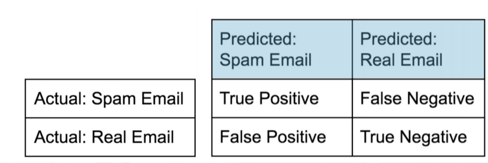
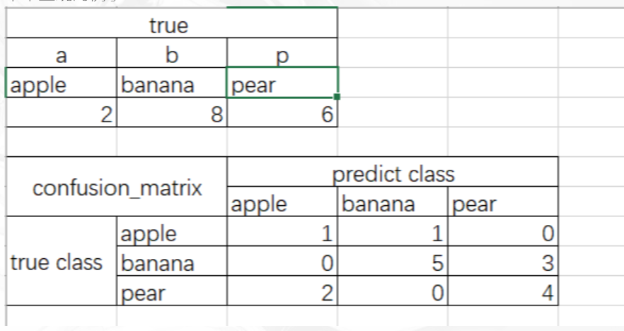
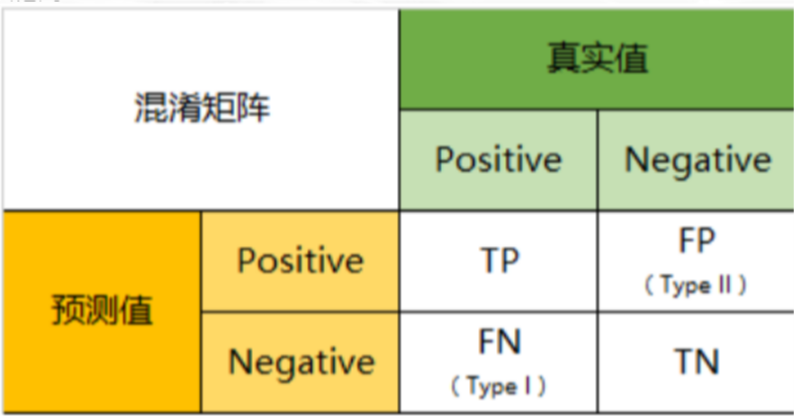
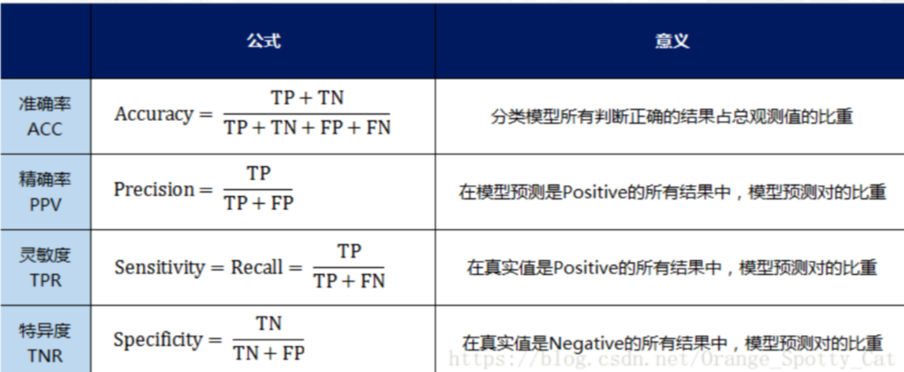
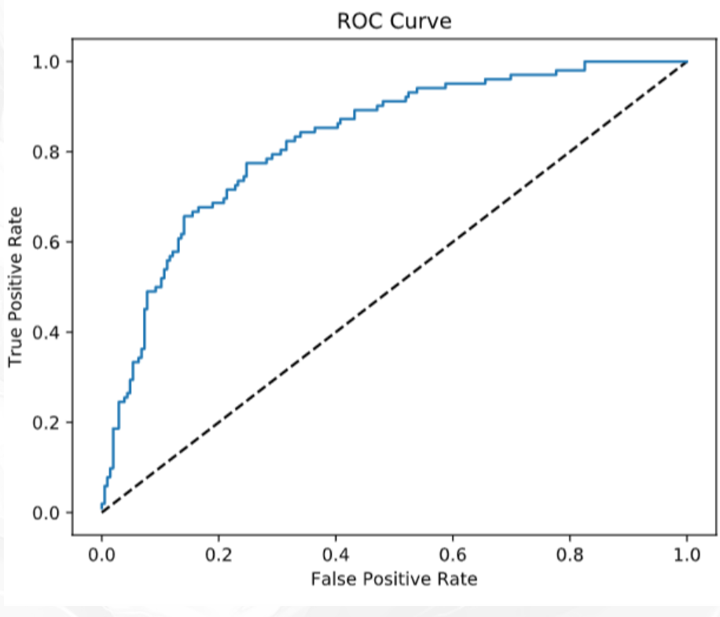

# 模型的评估与选择

>参考周志华老师的西瓜书

## 经验误差与过拟合

- 分类错误率：分错样本数占样本总数的比例
- 精度：1-分类错误率
- 误差：样本的实际预测值与样本的真实输出之间的差异

  - 训练误差：学习器在训练集上的误差(经验误差)
  - 泛化误差：在新样本上的误差，我们是希望它小，但事先并不知道新样本什么样，因此只能缩小经验误差
  
- 过拟合：学多了，以至于把训练样本不含的不太一般的特性都学习到了
- 欠拟合：学少了，比较容易克服

**过拟合是机器学习面临的关键障碍,过拟合不可避免，但是可以缩小**

- [ ] 这个需要总结

## 评估方法

>通常，可以根据实验测试来对学习器的泛化误差进行评估进而做出选择。因此需要使用一个test set来测试学习器对新样本的判别能力，然后用测试集上的“测试误差”“近似为泛化误差。

- 测试样本也是从样本真实分布中独立同分布取到
- 样本的训练集和测试集应该互斥

因为要保证”举一反三“的能力嘛！哈哈哈

## 留出法

简单粗暴
直接将数据集D划分为为两个互斥的集合，其中一个集合作为训练集S,另一个作为测试集T,S与T互斥。

分层抽样：保留类别比例的方式
可以先排序等在进行划分

缺点：

- S大，T小，评估结果不准确
- S小，T大，学习器训练的样本少，评估结果更加不准


scikit-learn中的train-test-split函数可以直接暴力划分
```python
# Import necessary modules
from sklearn.model_selection import train_test_split
from sklearn.linear_model import LogisticRegression
from sklearn.model_selection import GridSearchCV

# Create the hyperparameter grid
c_space = np.logspace(-5, 8, 15)
param_grid = {'C': c_space, 'penalty': ['l1', 'l2']}

# Instantiate the logistic regression classifier: logreg
logreg = LogisticRegression()

# Create train and test sets
X_train, X_test, y_train, y_test = train_test_split(X, y, test_size = 0.4, random_state=42)

# Instantiate the GridSearchCV object: logreg_cv
logreg_cv = GridSearchCV(logreg, param_grid, cv=5)

# Fit it to the training data
logreg_cv.fit(X_train, y_train)

# Print the optimal parameters and best score
print("Tuned Logistic Regression Parameter: {}".format(logreg_cv.best_params_))
print("Tuned Logistic Regression Accuracy: {}".format(logreg_cv.best_score_))

<script.py> output:
    Tuned Logistic Regression Parameter: {'C': 0.4393970560760795, 'penalty': 'l1'}
    Tuned Logistic Regression Accuracy: 0.7652173913043478
```

## 交叉验证法

>先将数据集D划分为k个大小相似的互斥子集,每个子集尽可能保持数据分布的一致性，即从D中通过分层抽样，然后每次用k-1个子集的并集作为训练集，余下的那个子集作为测试集，此时就可以获得k组训练集/测试集，从而进行k次训练和测试，最终返回的是k个结果的均值。

交叉验证法的稳定性和保真性很大程度上取决于k的取值

为减小因样本划分不同而引入的差别，通常使用随机划分不同子集重复

## 留一法

>m个样本只有唯一的划分方式划分为m个子集，每个子集包含一个样本。训练集与初始数据集相比只少了一个样本

因此精高。但是计算开销大

## 自助法

## 包外估计

## 模型性能度量

也就是泛化能力的评估标准
>回归中一般使用均方误差

下面主要介绍几种分类性能度量指标

## confusion_matrix
- 利用混淆矩阵进行评估
- 混淆矩阵说白了就是一张表格-
- 所有正确的预测结果都在对角线上，所以从混淆矩阵中可以很方便直观的看出哪里有错误，因为他们呈现在对角线外面。


```r

```


- 举个直观的例子

```r

```


这个表格是一个混淆矩阵

>正确的值是上边的表格，混淆矩阵是下面的表格，这就表示，apple应该有两个，但是只预测对了一个，其中一个判断为banana了，banana应该有8ge，但是5个预测对了3个判断为pear了，pear有应该有6个，但是2个判断为apple了，可见对角线上是正确的预测值，对角线之外的都是错误的。
这个混淆矩阵的实现代码

```python
from sklearn.metrics import confusion_matrix
from sklearn.metrics import classification_report
y_test=["a","b","p","b","b","b","b","p","b","p","b","b","p","p","p","a"]
y_pred=["a","b","p","p","p","p","b","p","b","p","b","b","a","a","p","b"]
confusion_matrix(y_test, y_pred,labels=["a", "b","p"])
#array([[1, 1, 0],
       [0, 5, 3],
       [2, 0, 4]], dtype=int64)

print(classification_report(y_test,y_pred))
##
               precision    recall  f1-score   support

          a       0.33      0.50      0.40         2
          b       0.83      0.62      0.71         8
          p       0.57      0.67      0.62         6

avg / total       0.67      0.62      0.64        16

```
我传到[github](https://github.com/gaowenxin95/machine-learing/tree/master/confusion-matrix_roc_auc_acc-score)上面了

混淆矩阵demo

```python
# Import necessary modules
from sklearn.metrics import classification_report

from sklearn.metrics import confusion_matrix

# Create training and test set
X_train, X_test, y_train, y_test = train_test_split(X,y,test_size=0.4,random_state=42)

# Instantiate a k-NN classifier: knn
knn = KNeighborsClassifier(6)

# Fit the classifier to the training data
knn.fit(X_train,y_train)

# Predict the labels of the test data: y_pred
y_pred = knn.predict(X_test)

# Generate the confusion matrix and classification report
print(confusion_matrix(y_test,y_pred))
print(classification_report(y_test,y_pred))

```

## 补充知识
**先给一个二分类的例子**
其他同理


```r

```


- TP(True Positive)：将正类预测为正类数，真实为0，预测也为0
- FN(False Negative)：将正类预测为负类数，真实为0，预测为1
- FP(False Positive)：将负类预测为正类数， 真实为1，预测为0
- TN(True Negative)：将负类预测为负类数，真实为1，预测也为1

>因此:预测性分类模型，肯定是希望越准越好。那么，对应到混淆矩阵中，那肯定是希望TP与TN的数量大，而FP与FN的数量小。所以当我们得到了模型的混淆矩阵后，就需要去看有多少观测值在第二、四象限对应的位置，这里的数值越多越好；反之，在第一、三四象限对应位置出现的观测值肯定是越少越好。

## 几个二级指标定义
- 准确率（Accuracy）—— 针对整个模型
$\frac{t p+t n}{t p+t n+f p+f n}$
- 精确率（Precision）
$\frac{t p}{t p+f n}$
- 灵敏度（Sensitivity）：就是召回率（Recall）召回率 = 提取出的正确信息条数 / 样本中的信息条数。通俗地说，就是所有准确的条目有多少被检索出来了
- 特异度（Specificity）


```r

```


## 三级指标
$\mathrm{F} 1$ Score $=\frac{2 \mathrm{PR}}{\mathrm{P}+\mathrm{R}}$
其中，P代表Precision，R代表Recall。
F1-Score指标综合了Precision与Recall的产出的结果。F1-Score的取值范围从0到1的，1代表模型的输出最好，0代表模型的输出结果最差[reference](https://blog.csdn.net/audio_algorithm/article/details/90374259)


## accuracy_score
分类准确率分数
- 分类准确率分数是指所有分类正确的百分比。分类准确率这一衡量分类器的标准比较容易理解，但是它不能告诉你响应值的潜在分布，并且它也不能告诉你分类器犯错的类型
```python
sklearn.metrics.accuracy_score(y_true, y_pred, normalize=True, sample_weight=None)
#normalize：默认值为True，返回正确分类的比例；如果为False，返回正确分类的样本数
```

```python
#accuracy_score
import numpy as np
from sklearn.metrics import accuracy_score
y_pred = [1, 9, 9, 5,1,0,2,2]
y_true = [1,9,9,8,0,6,1,2]
print(accuracy_score(y_true, y_pred))
print(accuracy_score(y_true, y_pred, normalize=False))

#4
#5
```

datacamp上面的一个例子

```python
# Import necessary modules
from sklearn.neighbors import KNeighborsClassifier 
from sklearn.model_selection import train_test_split

# Create feature and target arrays
X = digits.data
y = digits.target

# Split into training and test set
X_train, X_test, y_train, y_test = train_test_split(X, y, test_size = 0.2, random_state=42, stratify=y)

# Create a k-NN classifier with 7 neighbors: knn
knn = KNeighborsClassifier(n_neighbors=7)

# Fit the classifier to the training data
knn.fit(X_train, y_train)
y_pred=knn.predict(X_test)
# Print the accuracy
print(accuracy_score(y_test, y_pred))

#0.89996709
```

## ROC
- ROC曲线指受试者工作特征曲线/接收器操作特性(receiveroperating characteristic，ROC)曲线,
- 是反映灵敏性和特效性连续变量的综合指标,是用构图法揭示敏感性和特异性的相互关系，
- 它通过将连续变量设定出多个不同的临界值，从而计算出一系列敏感性和特异性。
- ROC曲线是根据一系列不同的二分类方式（分界值或决定阈），以真正例率（也就是灵敏度recall）（True Positive Rate,TPR）为纵坐标，假正例率（1-特效性，）（False Positive Rate,FPR）为横坐标绘制的曲线。
- 要与混淆矩阵想结合

横轴FPR

$\mathrm{FPR}=\frac{\mathrm{FP}}{\mathrm{FP}+\mathrm{TN}}$
在所有真实值为Negative的数据中，被模型错误的判断为Positive的比例

**如果两个概念熟，那就多看几遍**
:smile:

## 纵轴recall
这个好理解就是找回来
在所有真实值为Positive的数据中，被模型正确的判断为Positive的比例
$\mathrm{TPR}=\frac{\mathrm{TP}}{\mathrm{TP}+\mathrm{FN}}$

## ROC曲线解读

- FPR与TPR分别构成了ROC曲线的横纵轴，因此我们知道在ROC曲线中，每一个点都对应着模型的一次结果

- 如果ROC曲线完全在纵轴上，代表这一点上，x=0，即FPR=0。模型没有把任何negative的数据错误的判为positive，预测完全准确
不知道哪个大佬能做出来。。:heart:

- 如果ROC曲线完全在横轴上，代表这一点上，y=0，即TPR=0。模型没有把任何positive的数据正确的判断为positive，预测完全不准确。
平心而论，这种模型能做出来也是蛮牛的，因为模型真正做到了完全不准确，所以只要反着看结果就好了嘛:smile:

- 如果ROC曲线完全与右上方45度倾角线重合，证明模型的准确率是正好50%，错判的几率是一半一半

-因此，我们绘制出来ROC曲线的形状，是希望TPR大，而FPR小。因此对应在图上就是曲线尽量往左上角贴近。45度的直线一般被常用作Benchmark，即基准模型，我们的预测分类模型的ROC要能优于45度线，否则我们的预测还不如50/50的猜测来的准确

## ROC曲线绘制

- ROC曲线上的一系列点，代表选取一系列的阈值（threshold）产生的结果
- 在分类问题中，我们模型预测的结果不是negative/positive。而是一个negatvie或positive的概率。那么在多大的概率下我们认为观测值应该是negative或positive呢？这个判定的值就是阈值（threshold）。
- ROC曲线上众多的点，每个点都对应着一个阈值的情况下模型的表现。多个点连起来就是ROC曲线了

```python
sklearn.metrics.roc_curve(y_true,y_score,pos_label=None, sample_weight=None, drop_intermediate=True)
```
```python
# Import the necessary modules
from sklearn.linear_model import LogisticRegression
from sklearn.metrics import confusion_matrix ,classification_report

# Create training and test sets
X_train, X_test, y_train, y_test = train_test_split(X, y, test_size = 0.4, random_state=42)

# Create the classifier: logreg
logreg = LogisticRegression()

# Fit the classifier to the training data
logreg.fit(X_train,y_train)

# Predict the labels of the test set: y_pred
y_pred = logreg.predict(X_test)

# Compute and print the confusion matrix and classification report
print(confusion_matrix(y_test, y_pred))
print(classification_report(y_test, y_pred))


# Import necessary modules
from sklearn.metrics import roc_curve

# Compute predicted probabilities: y_pred_prob
y_pred_prob = logreg.predict_proba(X_test)[:,1]

# Generate ROC curve values: fpr, tpr, thresholds
fpr, tpr, thresholds = roc_curve(y_test, y_pred_prob)

# Plot ROC curve
plt.plot([0, 1], [0, 1], 'k--')
plt.plot(fpr, tpr)
plt.xlabel('False Positive Rate')
plt.ylabel('True Positive Rate')
plt.title('ROC Curve')
```

```r

```


## AUC （Area under the ROC curve）

- AUC它就是值ROC曲线下的面积是多大。每一条ROC曲线对应一个AUC值。AUC的取值在0与1之间。

- AUC = 1，代表ROC曲线在纵轴上，预测完全准确。不管Threshold选什么，预测都是100%正确的。

- 0.5 < AUC < 1，代表ROC曲线在45度线上方，预测优于50/50的猜测。需要选择合适的阈值后，产出模型。
- AUC = 0.5，代表ROC曲线在45度线上，预测等于50/50的猜测。

- 0 < AUC < 0.5，代表ROC曲线在45度线下方，预测不如50/50的猜测。

- AUC = 0，代表ROC曲线在横轴上，预测完全不准确。

```python
sklearn.metrics.auc(x, y, reorder=False)
```

```python
# Import necessary modules
from sklearn.model_selection import cross_val_score
from sklearn.metrics import roc_auc_score

# Compute predicted probabilities: y_pred_prob
y_pred_prob = logreg.predict_proba(X_test)[:,1]

# Compute and print AUC score
print("AUC: {}".format(roc_auc_score(y_test, y_pred_prob)))

# Compute cross-validated AUC scores: cv_auc
cv_auc = cross_val_score(logreg, X, y, cv=5, scoring='roc_auc')

# Print list of AUC scores
print("AUC scores computed using 5-fold cross-validation: {}".format(cv_auc))

<script.py> output:
    AUC: 0.8254806777079764
    AUC scores computed using 5-fold cross-validation: [0.80148148 0.8062963  0.81481481 0.86245283 0.8554717 ]
```


## Precision-recall Curve

召回曲线也可以作为评估模型好坏的标准
- which is generated by plotting the precision and recall for different thresholds. As a reminder, precision and recall are defined as:
Precision $=\frac{T P}{T P+F P}$
Recall$=\frac{T P}{T P+F N}$


## classification_report

测试模型精度的方法很多，可以看下官方文档的例子，记一些常用的即可
API官方文档
https://scikit-learn.org/stable/modules/classes.html


## MSE&RMSE
方差，标准差
MSE:$(y_真实-y_预测)^2$之和
RMSE：MSE开平方

```python
# Import necessary modules
from sklearn.linear_model import ElasticNet
from sklearn.metrics import mean_squared_error
from sklearn.model_selection import GridSearchCV
from sklearn.model_selection import train_test_split

# Create train and test sets
X_train, X_test, y_train, y_test = train_test_split(X, y, test_size = 0.4, random_state=42)

# Create the hyperparameter grid
l1_space = np.linspace(0, 1, 30)
param_grid = {'l1_ratio': l1_space}

# Instantiate the ElasticNet regressor: elastic_net
elastic_net = ElasticNet()

# Setup the GridSearchCV object: gm_cv
gm_cv = GridSearchCV(elastic_net, param_grid, cv=5)

# Fit it to the training data
gm_cv.fit(X_train, y_train)

# Predict on the test set and compute metrics
y_pred = gm_cv.predict(X_test)
r2 = gm_cv.score(X_test, y_test)
mse = mean_squared_error(y_test, y_pred)
print("Tuned ElasticNet l1 ratio: {}".format(gm_cv.best_params_))
print("Tuned ElasticNet R squared: {}".format(r2))
print("Tuned ElasticNet MSE: {}".format(mse))

<script.py> output:
    Tuned ElasticNet l1 ratio: {'l1_ratio': 0.20689655172413793}
    Tuned ElasticNet R squared: 0.8668305372460283
    Tuned ElasticNet MSE: 10.05791413339844
```


