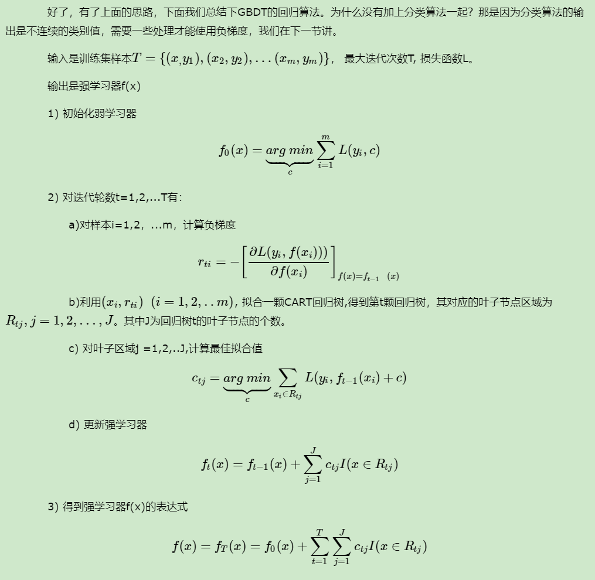
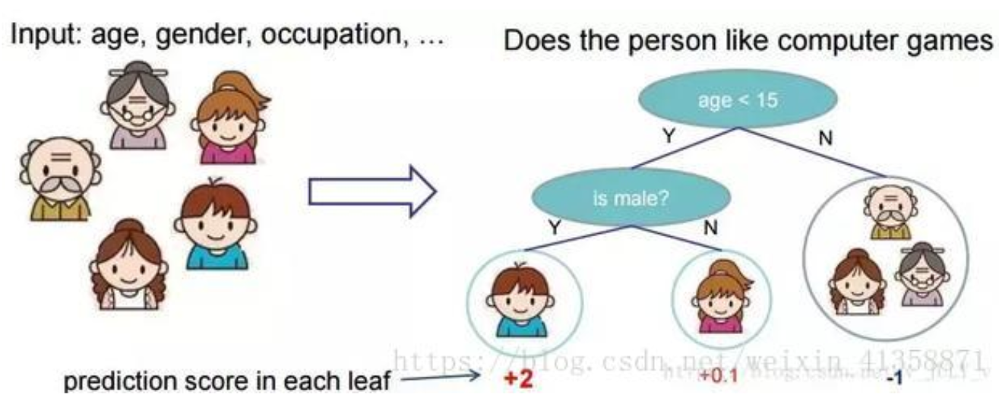
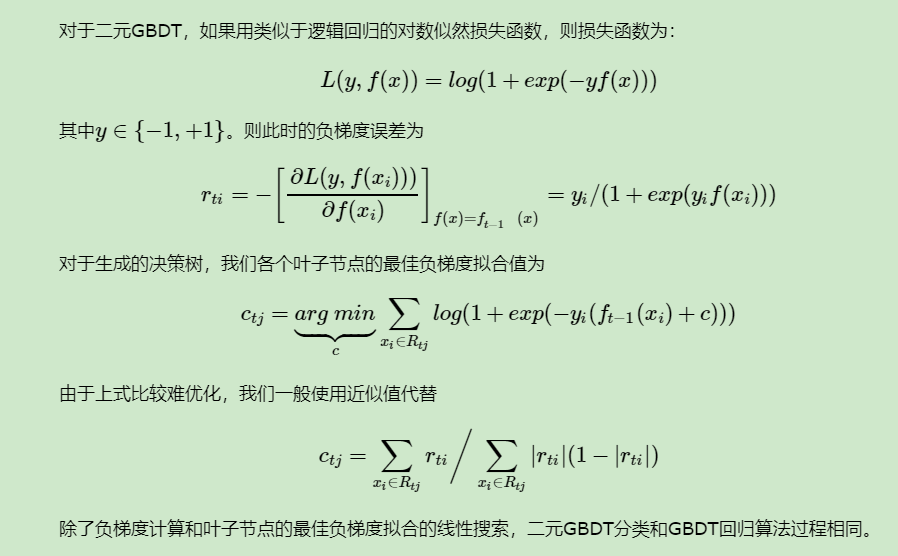
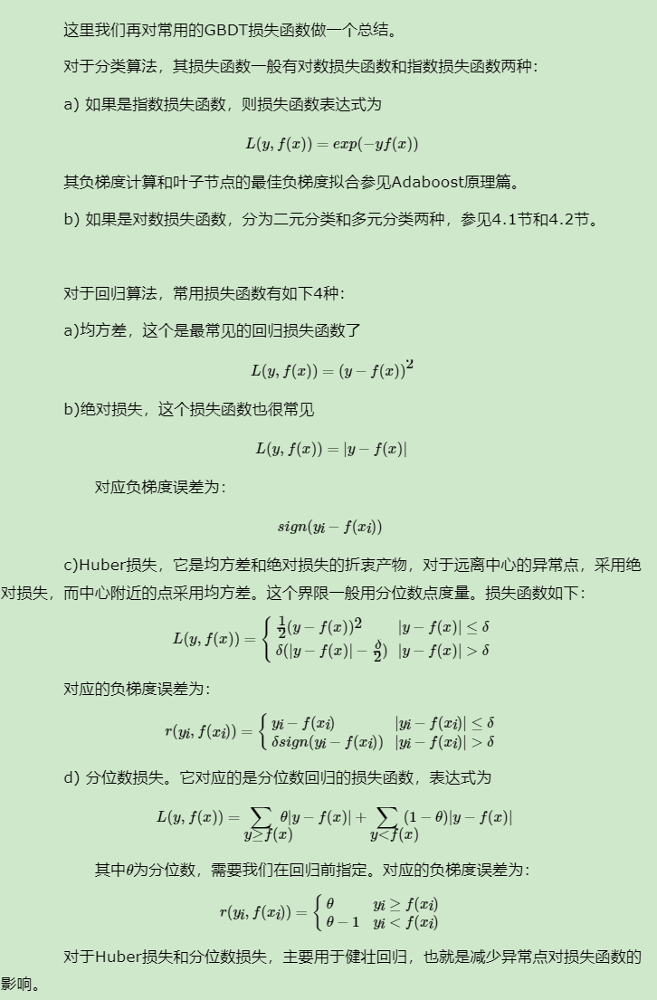

# Gradient Boost Decision Tree

梯度增强决策树
GBDT的子采样是无放回采样，而Bagging的子采样是放回采样

## 定义

哈哈，偷个懒，mathpix这个月的免费次数用完了。。

```r
knitr::include_graphics("./figs/06.png")
```


[图片来源知乎](https://zhuanlan.zhihu.com/p/29765582)
GBDT的含义就是用Gradient Boosting的策略训练出来的DT模型。模型的结果是一组回归分类树组合(CART Tree Ensemble)：$T_1...T_K$ 。其中 $T_j$ 学习的是之前 $j-1$棵树预测结果的残差，这种思想就像准备考试前的复习，先做一遍习题册，然后把做错的题目挑出来，在做一次，然后把做错的题目挑出来在做一次，经过反复多轮训练，取得最好的成绩。[知乎](https://zhuanlan.zhihu.com/p/30339807)

目前我的理解就是：先随机抽取一些样本进行训练，得到一个基分类器，然后再次训练拟合模型的残差。一轮一轮进行迭代直到模型的残差很小了
残差的定义：$y_{真实}-y_{预测}$，前一个基分类器未能拟合的部分也就是残差，于是新分类器继续拟合，直到残差达到指定的阈值。

在GBDT的迭代中，假设我们前一轮迭代得到的强学习器是$f_{t−1}(x)$, 损失函数是$L(y,f_{t−1}(x))$, 我们本轮迭代的目标是找到一个CART回归树模型的弱学习器$h_{t(x)}$，让本轮的损失函数L(y,${t(x)}=L(y,f_{t−1}(x))+h_{t(x)}$最小。也就是说，本轮迭代找到决策树，要让样本的损失尽量变得更小。

## 梯度下降

GBDT的基本思路就是不断地拟合残差，但是没有解决损失函数拟合方法的问题。针对这个问题，大牛Freidman提出了用损失函数的负梯度来拟合本轮损失的近似值，进而拟合一个CART回归树。第t轮的第i个样本的损失函数的负梯度表示为

$$r_{t i}=-\left[\frac{\left.\partial L\left(y_{i}, f\left(x_{i}\right)\right)\right)}{\partial f\left(x_{i}\right)}\right]_{f(x)=f_{t-1}(x)}$$

负梯度就是残差，哈哈哈

利用$\left(x_{i}, r_{t i}\right)(i=1,2, \dots m)$,我们可以拟合一颗CART回归树，得到了第t颗回归树，其对应的叶节点区域$R_{t j}, j=1,2, \ldots, J$。其中J为叶子节点的个数
。
针对每一个叶子节点里的样本，我们求出使损失函数最小，也就是拟合叶子节点最好的的输出值$c_{t j}$如下：
$$c_{t j}=\underbrace{\arg \min }_{c} \sum_{x_{i} \in R_{t j}} L\left(y_{i}, f_{t-1}\left(x_{i}\right)+c\right)$$

这样我们就得到了本轮的决策树拟合函数如下：
$$h_{t}(x)=\sum_{j=1}^{J} c_{t j} I\left(x \in R_{t j}\right)$$

从而本轮最终得到的强学习器的表达式如下：
$$f_{t}(x)=f_{t-1}(x)+\sum_{j=1}^{J} c_{t j} I\left(x \in R_{t j}\right)$$

## GBDT回归

思想是一样的


```r

```


[liu](https://www.cnblogs.com/pinard/p/6140514.html)

**举个栗子**
预测一家人谁是谁

可以先按照age划分男女得到一个分数


```r

```


就这样，训练出了2棵树tree1和tree2，类似之前gbdt的原理，两棵树的结论累加起来便是最终的结论，所以小孩的预测分数就是两棵树中小孩所落到的结点的分数相加：2 + 0.9 = 2.9。爷爷的预测分数同理：-1 + （-0.9）= -1.9


```r
knitr::include_graphics("./figs/20.png")
```


这个就是GBDT回归的一个栗子，即把每棵树的最优叶子结点相加，图来自陈天奇的ppt

**平方损失函数MSE：这个是针对回归算法来说的**$\frac{1}{2} \sum_{0}^{n}\left(y_{i}-F\left(x_{i}\right)\right)^{2}$
熟悉其他算法的原理应该知道，这个损失函数主要针对回归类型的问题，分类则是用熵值类的损失函数。具体到平方损失函数的式子，你可能已经发现它的一阶导其实就是残差的形式，所以基于残差的GBDT是一种特殊的GBDT模型，它的损失函数是平方损失函数，常用来处理回归类的问题。具体形式可以如下表示：
**损失函数：**$L(y, F(x))=\frac{1}{2}(y-F(X))^{2}$
因此求最小化的$J=\frac{1}{2}(y-F(X))^{2}$
哈哈此使可以求一阶导数了
**损失函数的一阶导数（梯度）：**$\frac{\partial J}{\partial F\left(x_{i}\right)}=\frac{\partial \sum_{i} L\left(y_{i}, F\left(x_{i}\right)\right)}{\partial F\left(x_{i}\right)}=\frac{\partial L\left(y_{i}, F\left(x_{i}\right)\right)}{\partial F\left(x_{i}\right)}=F\left(x_{i}\right)-y_{i}$
而参数就是负的梯度：$y_{i}-F\left(x_{i}\right)=-\frac{\partial J}{\partial F\left(x_{i}\right)}$

### 评价
基于残差的GBDT在解决回归问题上不算是一个好的选择，一个比较明显的缺点就是对异常值过于敏感。
当存在一个异常值的时候，就会导致残差灰常之大。。自行理解

## GBDT分类算法
这里我们再看看GBDT分类算法，GBDT的分类算法从思想上和GBDT的回归算法没有区别，但是由于样本输出不是连续的值，而是离散的类别，导致我们无法直接从输出类别去拟合类别输出的误差。
为了解决这个问题，主要有两个方法，一个是用指数损失函数，此时GBDT退化为Adaboost算法。另一种方法是用类似于逻辑回归的**对数似然损失函数**的方法。也就是说，我们用的是类别的预测概率值和真实概率值的差来拟合损失。本文仅讨论用对数似然损失函数的GBDT分类。而对于对数似然损失函数，我们又有二元分类和多元分类的区别。

```r

```


这里就是用到逻辑回归的损失函数了，其求导的特殊性

## 常见损失函数


```r

```


## boosting


gbdt模型可以认为是是由k个基模型组成的一个加法运算式

$\hat{y}_{i}=\sum_{k=1}^{K} f_{k}\left(x_{i}\right), f_{k} \in F$

其中F是指所有基模型组成的函数空间
那么一般化的损失函数是预测值 $\hat{y}_{i}$ 与 真实值$y_{i}$ 之间的关系，如我们前面的平方损失函数，那么对于n个样本来说，则可以写成
$L=\sum_{i=1}^{n} l\left(y_{i}, \hat{y}_{i}\right)$

更一般的，我们知道一个好的模型，在偏差和方差上有一个较好的平衡，而算法的损失函数正是代表了模型的偏差面，最小化损失函数，就相当于最小化模型的偏差，但同时我们也需要兼顾模型的方差，所以目标函数还包括抑制模型复杂度的正则项，因此目标函数可以写成
$O b j=\sum_{i=1}^{n} l\left(y_{i}, \hat{y}_{i}\right)+\sum_{k=1}^{K} \Omega\left(f_{k}\right)$
其中 $\Omega$ 代表了基模型的复杂度，若基模型是树模型，则树的深度、叶子节点数等指标可以反应树的复杂程度。


## 调参

见https://www.cnblogs.com/pinard/p/6143927.html

## demo

[看一个官方案例](https://mybinder.org/v2/gh/scikit-learn/scikit-learn/b194674c42d54b26137a456c510c5fdba1ba23e0?urlpath=lab%2Ftree%2Fnotebooks%2Fauto_examples%2Fensemble%2Fplot_gradient_boosting_regression.ipynb)


