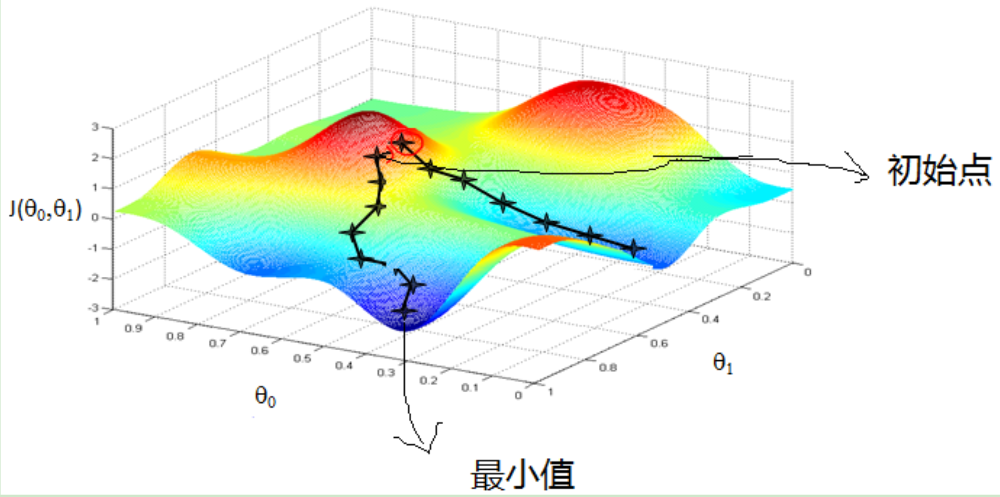
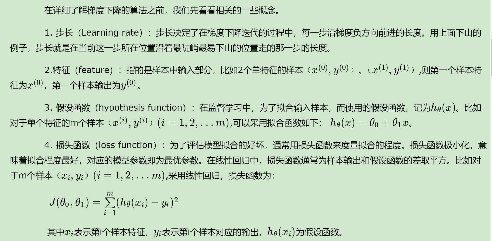

# 方法

## 梯度下降

在求解机器学习算法的模型参数，即无约束优化问题时，梯度下降（Gradient Descent）是最常采用的方法之一，另一种常用的方法是最小二乘法。这里就对梯度下降法做一个完整的总结。

## 梯度

>在微积分里面，对多元函数的参数求∂偏导数，把求得的各个参数的偏导数以向量的形式写出来，就是梯度。比如函数f(x,y), 分别对x,y求偏导数，求得的梯度向量就是(∂f/∂x, ∂f/∂y)T,简称grad f(x,y)或者▽f(x,y)。对于在点(x0,y0)的具体梯度向量就是(∂f/∂x0, ∂f/∂y0)T.或者▽f(x0,y0)，如果是3个参数的向量梯度，就是(∂f/∂x, ∂f/∂y，∂f/∂z)T,以此类推
。

其实就可以理解为梯度下降是求偏导

>那么这个梯度向量求出来有什么意义呢？他的意义从几何意义上讲，就是函数变化增加最快的地方。具体来说，对于函数f(x,y),在点(x0,y0)，沿着梯度向量的方向就是(∂f/∂x0, ∂f/∂y0)T的方向是f(x,y)增加最快的地方。或者说，沿着梯度向量的方向，更加容易找到函数的最大值。反过来说，沿着梯度向量相反的方向，也就是 -(∂f/∂x0, ∂f/∂y0)T的方向，梯度减少最快，也就是更加容易找到函数的最小值。

梯度就是函数变化最快的地方

## 上升vs下降

>在机器学习算法中，在最小化损失函数时，可以通过梯度下降法来一步步的迭代求解，得到最小化的损失函数，和模型参数值。反过来，如果我们需要求解损失函数的最大值，这时就需要用梯度上升法来迭代了。

对的，求min

梯度下降法和梯度上升法是可以互相转化的。比如我们需要求解损失函数f(θ)的最小值，这时我们需要用梯度下降法来迭代求解。但是实际上，我们可以反过来求解损失函数-f(θ)的最大值，这时梯度上升法就派上用场了。


## 梯度下降

>首先来看看梯度下降的一个直观的解释。比如我们在一座大山上的某处位置，由于我们不知道怎么下山，于是决定走一步算一步，也就是在每走到一个位置的时候，求解当前位置的梯度，沿着梯度的负方向，也就是当前最陡峭的位置向下走一步，然后继续求解当前位置梯度，向这一步所在位置沿着最陡峭最易下山的位置走一步。这样一步步的走下去，一直走到觉得我们已经到了山脚。当然这样走下去，有可能我们不能走到山脚，而是到了某一个局部的山峰低处。

从上面的解释可以看出，梯度下降不一定能够找到全局的最优解，有可能是一个局部最优解。当然，如果损失函数是**凸函数**，梯度下降法得到的解就一定是全局最优解。

因此很多时候可以转化为凸函数


```r

```


```r

```


算法的推导可以参考[刘建平](https://www.cnblogs.com/pinard/p/5970503.html)


##  最小二乘

最小二乘法是用来做函数拟合或者求函数极值的方法。在机器学习，尤其是回归模型中，经常可以看到最小二乘法的身影，这里就对我对最小二乘法的认知做一个小结。[liu]https://www.cnblogs.com/pinard/p/5976811.html

## 牛顿法


## 坐标轴下降
