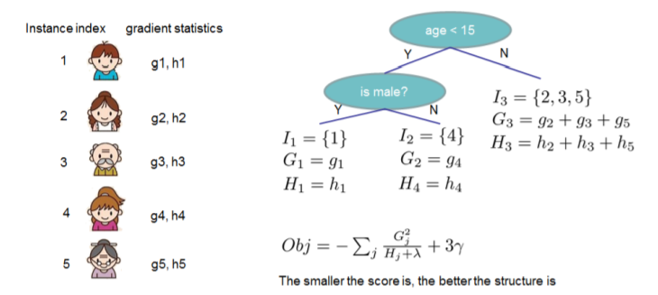
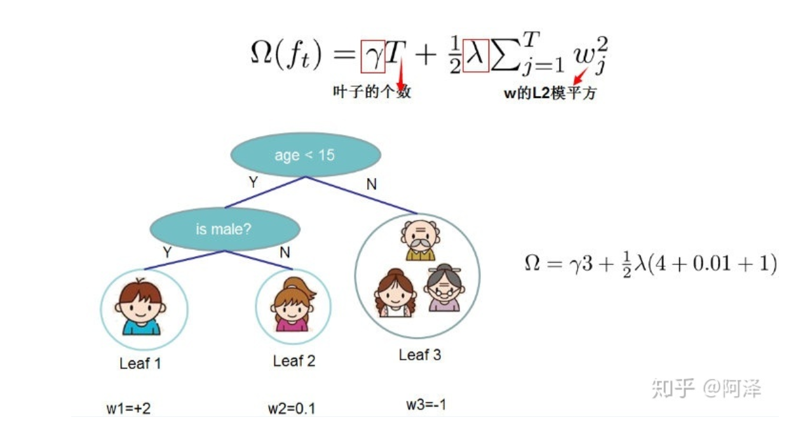
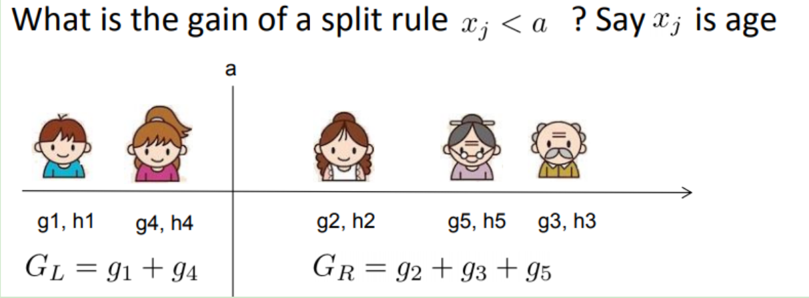
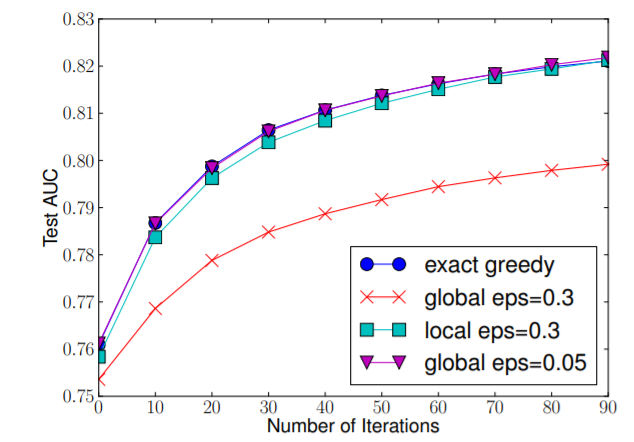
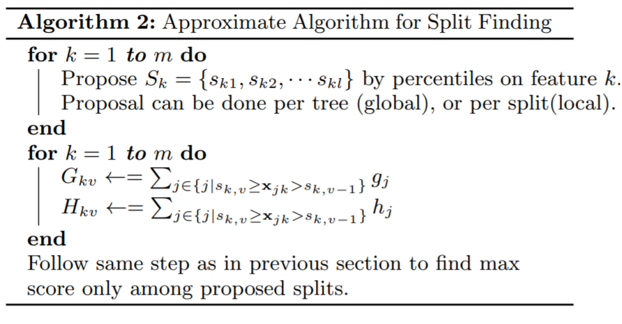
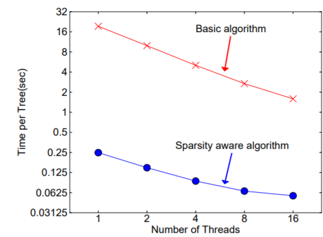
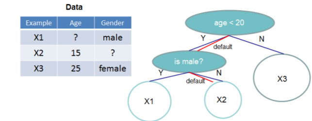
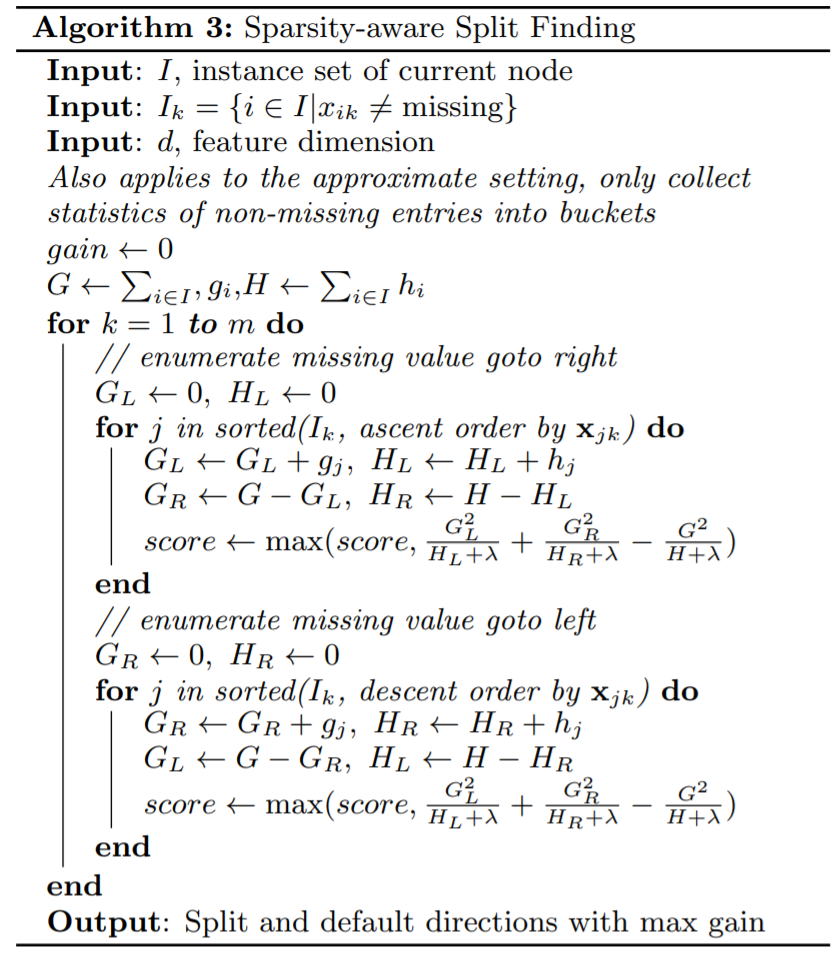
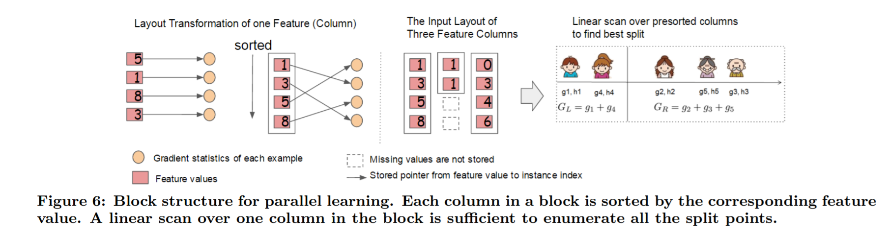

# XGBoost

其实这个部分是有一个专门的bookdown的，但是还是想做一个总结，确保自己真正的理解了，不理解的就再请教一下学长好了，嘻嘻。。他说他知道我的问题在哪。。。。蛤我惊了！！！

一是算法本身的优化：在算法的弱学习器模型选择上，对比GBDT只支持决策树，还可以直接很多其他的弱学习器。在算法的损失函数上，除了本身的损失，还加上了正则化部分。在算法的优化方式上，GBDT的损失函数只对误差部分做负梯度（一阶泰勒）展开，而XGBoost损失函数对误差部分做二阶泰勒展开，更加准确。算法本身的优化是我们后面讨论的重点。

二是算法运行效率的优化：对每个弱学习器，比如决策树建立的过程做并行选择，找到合适的子树分裂特征和特征值。在并行选择之前，先对所有的特征的值进行排序分组，方便前面说的并行选择。对分组的特征，选择合适的分组大小，使用CPU缓存进行读取加速。将各个分组保存到多个硬盘以提高IO速度。

三是算法健壮性的优化：对于缺失值的特征，通过枚举所有缺失值在当前节点是进入左子树还是右子树来决定缺失值的处理方式。算法本身加入了L1和L2正则化项，可以防止过拟合，泛化能力更强。


## 基本知识

**决策树的作用:**即依靠某种指标进行树的分裂达到分类/回归的目的，总是希望纯度越高越好.

Xgboost就是由很多**分类和回归树集成**。

数据挖掘或机器学习中使用的决策树有两种主要类型：
- 分类树分析是指预测结果是数据所属的类“yes or no”，“do or don't”
- 回归树分析是指预测结果可以被认为是实数（例如物价，时间长短）

之前学习的CART就是分类回归树的总称

**举个栗子：**
- 判断高文星星是不是女的：结果是or不是
- 预测高文星星2016-2019年的花呗欠债额度：结果就是0-10000之间的任意数值了

>对于回归树，没法再用分类树那套信息增益、信息增益率、基尼系数来判定树的节点分裂了，你需要采取新的方式评估效果，包括预测误差（常用的有均方误差、对数误差等）。而且节点不再是类别，是数值（预测值），那么怎么确定呢？有的是节点内样本均值，有的是最优化算出来的比如Xgboost

**集成学习**

所谓集成学习，是指构建多个分类器（弱分类器）对数据集进行预测，然后用某种策略将多个分类器预测的结果集成起来，作为最终预测结果。通俗比喻就是“三个臭皮匠赛过诸葛亮”，或一个公司董事会上的各董事投票决策，它要求每个弱分类器具备一定的“准确性”，分类器之间具备“差异性”。

集成学习根据各个弱分类器之间有无依赖关系，分为Boosting和Bagging两大流派：

- Boosting流派，各分类器之间有依赖关系，必须串行(当前分类器的训练是要依据前一个的结果的)，比如Adaboost、GBDT(Gradient Boosting Decision Tree)、Xgboost
- Bagging流派，各分类器之间没有依赖关系，可各自并行，比如随机森林（Random Forest）


>boosting集成学习由多个相关联的决策树联合决策，什么叫相关联？举个例子
1、有一个样本[数据->标签]是：[(2，4，5)-> 4]
2、第一棵决策树用这个样本训练的预测为3.3
3、那么第二棵决策树训练时的输入，这个样本就变成了：[(2，4，5)-> 0.7]
4、也就是说，下一棵决策树输入样本会与前面决策树的训练和预测相关很快你会意识到，Xgboost为何也是一个boosting的集成学习了。

而一个回归树形成的关键点在于：
1.分裂点依据什么来划分（如前面说的均方误差最小，loss）；
2.分类后的节点预测值是多少（如前面说，有一种是将叶子节点下各样本实际值得均值作为叶子节点预测误差，或者计算所得）

至于另一类集成学习方法，比如RandomForest（随机森林）算法，各个决策树是独立的、每个决策树在样本堆里随机选一批样本，随机选一批特征进行独立训练，各个决策树之间没有啥关系。主要就是vote就好

理解完Adaboost和GBDT的概念之后理解xgb会比较轻松一点，因为xgb可以解决前面两个的缺陷。


## xgb的定义

xgb是gbdt的增强版，就是原理很相似，主要是目标函数定义会有很大的差别，但是也有别的差别

目标函数
$$\begin{aligned} O b j^{(t)} &=\sum_{i=1}^{n} l\left(y_{i}, \hat{y}_{i}^{t}\right)+\sum_{i=i}^{t} \Omega\left(f_{i}\right) \\ &=\sum_{i=1}^{n} l\left(y_{i}, \hat{y}_{i}^{t-1}+f_{t}\left(x_{i}\right)\right)+\Omega\left(f_{t}\right)+\text { constant } \end{aligned}$$
$\Omega\left(f_{t}\right)$是正则项，这个后面展开
constant是常数项可以考虑忽略

利用泰勒展开式近似这个目标函数：
$$f(x+\Delta x) \simeq f(x)+f^{\prime}(x) \Delta x+\frac{1}{2} f^{\prime \prime}(x) \Delta x^{2}$$
那么在目标函数中中，我们把 $\hat{y}_{i}^{t-1}$ 看成是等式泰勒展开式中的$x$， $f_{t}\left(x_{i}\right)$  看成是 $\Delta x$ ，因此等式目标函数可以写成：


$$O b j^{(t)}=\sum_{i=1}^{n}\left[l\left(y_{i}, \hat{y}_{i}^{t-1}\right)+g_{i} f_{t}\left(x_{i}\right)+\frac{1}{2} h_{i} f_{t}^{2}\left(x_{i}\right)\right]+\Omega\left(f_{t}\right)+ constant  $$

方括号里面的是损失函数，常见的损失函数有均方误差，logistic损失函数$l\left(y_{i}, \hat{y}_{i}\right)=y_{i} \ln \left(1+e^{-y_{i}}\right)+\left(1-y_{i}\right) \ln \left(1+e^{y_{i}}\right)$等

其中 $g_{i}$ 为损失函数的一阶导， $h_i$ **为损失函数的二阶导，注意这里的导是对 $\hat{y}_{i}^{t-1}$ 求导**。我们以平方损失函数为例$\sum_{i=1}^{n}\left(y_{i}-\left(\hat{y}_{i}^{t-1}+f_{t}\left(x_{i}\right)\right)\right)^{2}$ ，则分别给出$g_i$,$h_i$就是第$t$个学习器的一阶导和二阶导


$$g_{i}=\partial_{\hat{y}^{t-1}}\left(\hat{y}^{t-1}-y_{i}\right)^{2}=2\left(\hat{y}^{t-1}-y_{i}\right),$$

$$\quad h_{i}=\partial_{\hat{y}^{t-1}}^{2}\left(\hat{y}^{t-1}-y_{i}\right)^{2}=2$$
看这个式子或许更清楚
$g_{t}=\frac{\partial L\left(y_{i}, f_{t-1}\left(x_{i}\right)\right.}{\partial f_{t-1}\left(x_{i}\right)}, h_{t}=\frac{\partial^{2} L\left(y_{i}, f_{t-1}\left(x_{i}\right)\right.}{\partial f_{t-1}^{2}\left(x_{i}\right)}$


由于在第t步 $\hat{y}_{i}^{t-1}$ 其实是一个已知的值(残差)，所以 $l\left(y_{i}, \hat{y}_{i}^{t-1}\right)$是一个常数，其对函数优化不会产生影响，因此，目标函数可以写成：
$$O b j^{(t)} \approx \sum_{i=1}^{n}\left[g_{i} f_{t}\left(x_{i}\right)+\frac{1}{2} h_{i} f_{t}^{2}\left(x_{i}\right)\right]+\Omega\left(f_{t}\right)$$


另外$f_{t}(x_i)$可以转化为$w_{q(x)}$,其中$q(x)$ 代表了每个样本在哪个叶子结点上,而 $w_q$ 则代表了哪个叶子结点取什么$w$值,所以$w_{q(x)}$就代表了每个样本的取值$w_j$ (即预测值).

我们假设$I_{j}=\left\{i | q\left(x_{i}\right)=j\right\}$为第j个叶子节点的样本集合，则上式根据上面的一些变换可以写成：

$$\begin{aligned} O b j^{(t)} & \approx \sum_{i=1}^{n}\left[g_{i} f_{t}\left(x_{i}\right)+\frac{1}{2} h_{i} f_{t}^{2}\left(x_{i}\right)\right]+\Omega\left(f_{t}\right) \\ &=\sum_{i=1}^{n}\left[g_{i} w_{q\left(x_{i}\right)}+\frac{1}{2} h_{i} w_{q\left(x_{i}\right)}^{2}\right]+\gamma T+\frac{1}{2} \lambda \sum_{j=1}^{T} w_{j}^{2} \\ &=\sum_{j=1}^{T}\left[\left(\sum_{i \in I_{j}} g_{i}\right) w_{j}+\frac{1}{2}\left(\sum_{i \in I_{j}} h_{i}+\lambda\right) w_{j}^{2}\right]+\gamma T \end{aligned}$$                                          
**第二步是遍历所有的样本后求每个样本的损失函数，但样本最终会落在叶子节点上，所以我们也可以遍历叶子节点，然后获取叶子节点上的样本集合，最后在求损失函数。**
即我们之前样本的集合，现在都改写成叶子结点的集合，由于一个叶子结点有多个样本存在，因此才有了$\sum_{i \in I_{j}} g_{i}$和$\sum_{i \in I_{j}} h_{i}$两 项，然后定义$G_i=\sum_{i \in I_{j}} g_{i}$,$H_i=\sum_{i \in I_{j}} h_{i}$,

则上式可以写成:
$$O b j^{(t)}=\sum_{j=1}^{T}\left[G_{j} w_{j}+\frac{1}{2}\left(H_{j}+\lambda\right) w_{j}^{2}\right]+\gamma T$$
这里我们要注意 $G_i=\sum_{i \in I_{j}} g_{i}$,$H_i=\sum_{i \in I_{j}} h_{i}$,是前t-1步得到的结果，其值已知可视为常数，只有最后一棵树的叶子节点 $w_{j}$ 不确定，那么将目标函数对 $w_{j}$ 求一阶导并令其等0，则可以求得叶子结点 j对应的权值：
$$w_{j}^{*}=-\frac{G_{j}}{H_{j}+\lambda}$$
此时目标函数就可以简化为
$$O b j=-\frac{1}{2} \sum_{j=1}^{T} \frac{G_{j}^{2}}{H_{j}+\lambda}+\gamma T$$
**最终的目标函数只依赖于每个数据点的在误差函数上的一阶导数和二阶导数**


```r

```


## 目标函数的正则项

目标是建立K个回归树，使得树群的预测值尽量接近真实值（准确率）而且有尽量大的泛化能力（更为本质的东西）

目标函数不考虑常数项可以简写成：
$L(\phi)=\sum_{i} l\left(\hat{y}_{i}-y_{i}\right)+\sum_{k} \Omega\left(f_{k}\right)$
有损失函数和正则项构成

**正则项**:


是考虑模型的复杂度的，在logistic那里有专门的讲过的，因此逻辑回归是基础，蛤蛤

表示树的复杂度的函数，值越小复杂度越低，泛化能力越强

正则表达式:
$$\Omega(f)=\gamma T+\frac{1}{2} \lambda\|w_j\|^{2}$$
$T$表示叶子节点的个数，$w_j$表示第j个节点的数值。直观上看，目标要求预测误差尽量小，且叶子节点$T$尽量少，节点数值$w_j$尽量不极端。

因此xgboost算法中对树的复杂度项包含了两个部分，一个是叶子节点个数$T$，一个是叶子节点得分，L2正则化项$w_j$，针对每个叶结点的得分增加L2平滑，目的也是为了避免过拟合

假设弱学习器是**决策树**下面给出了xgb基于正则项的求解方式

```r

```


从而，加了正则项的目标函数里就出现了两种累加

- 一种是$i - > n$（样本数）

- 一种是$j -> T$（叶子节点数）

一般来说，目标函数都包括两项损失函数和正则项
$\operatorname{Obj}(\Theta)=L(\Theta)+\Omega(\Theta)$

- 损失函数(误差函数)是为了说明模型拟合数据集的效果
- 正则项是为了惩罚模型的复杂度


>误差函数鼓励我们的模型尽量去拟合训练数据，使得最后的模型会有比较少的bias。而正则化项则鼓励更加简单的模型。因为当模型简单之后，有限数据拟合出来结果的随机性比较小，不容易过拟合，使得最后模型的预测更加稳定

**xgboost的原始论文中给出了两种分裂节点的方法**


## 枚举所有不同树结构的贪心法

目标函数的最终定义是当我们指定一个树的结构的时候，我们在目标上面最多减少多少。我们可以把它叫做结构分数(structure score)

不断地枚举不同树的结构，利用这个打分函数来寻找出一个最优结构的树，加入到我们的模型中，再重复这样的操作。不过枚举所有树结构这个操作不太可行，所以常用的方法是贪心法，每一次尝试去对已有的叶子加入一个分割。对于一个具体的分割方案，我们可以获得的增益可以由如下公式计算。

在GBDT里面，我们是直接拟合的CART回归树，所以树节点分裂使用的是均方误差。XGBoost这里不使用均方误差，而是使用贪心法，即每次分裂都期望最小化我们的损失函数的误差

$$\begin{aligned} \hat{y}_{i}^{(0)} &=0 \\ \hat{y}_{i}^{(1)} &=f_{1}\left(x_{i}\right)=\hat{y}_{i}^{(0)}+f_{1}\left(x_{i}\right) \\ \hat{y}_{i}^{(2)} &=f_{1}\left(x_{i}\right)+f_{2}\left(x_{i}\right)=\hat{y}_{i}^{(1)}+f_{2}\left(x_{i}\right) \\ & \cdots \\ \hat{y}_{i}^{(t)} &=\sum_{k=1}^{t} f_{k}\left(x_{i}\right)=\hat{y}_{i}^{(t-1)}+f_{t}\left(x_{i}\right) \end{aligned}$$

因此在训练的第$t$步$\hat{y}_{i}^{(t-1)}$是已知对的，就是找到一个$f_{t}\left(x_{i}\right) $使得目标函数更加优化的更快。

**贪心算法的流程**

- 从深度为0的树开始，对每个叶节点**枚举所有的可用特征**； 

- 针对每个特征，把属于该节点的训练样本根据该特征值进行升序排列，通过线性扫描的方式来决定该特征的最佳分裂点，并记录该特征的分裂收益；

- 选择收益最大的特征作为分裂特征，用该特征的最佳分裂点作为分裂位置，在该节点上分裂出左右两个新的叶节点，并为每个新节点关联对应的样本集回到第 1 步，递归执行到满足特定条件为止

**计算每个特征的收益**

那么如何计算上面的收益呢，很简单，仍然紧扣目标函数就可以了。假设我们在某一节点上二分裂成两个节点，分别是**左（L）右（R）**，则分列前的目标函数是:
$$-\frac{1}{2}\left[\frac{\left(G_{L}+G_{R}\right)^{2}}{H_{L}+H_{R}+\lambda}\right]+\gamma$$
分裂后
$$-\frac{1}{2}\left[\frac{G_{L}^{2}}{H_{L}+\lambda}+\frac{G_{R}^{2}}{H_{R}+\lambda}\right]+2\gamma$$
则对于目标函数来说，分裂后的收益是（这里假设是最小化目标函数，所以用分裂前-分裂后）
$$Gain =\frac{1}{2}\left[\frac{G_{L}^{2}}{H_{L}+\lambda}+\frac{G_{R}^{2}}{H_{R}+\lambda}-\frac{\left(G_{L}+G_{R}\right)^{2}}{H_{L}+H_{R}+\lambda}\right]-\gamma$$

如果增益Gain>0，即分裂为两个叶子节点后，目标函数下降了，那么我们会考虑此次分裂的结果。

**高效的枚举**
我们可以发现对于所有的分裂点，我们只要做一遍从左到右的扫描就可以枚举出所有分割的梯度和$G_{L}$和$G_{R}$。然后用上面的公式计算每个分割方案的分数就可以了。

对于每次扩展，我们还是要枚举所有可能的分割方案，如何高效地枚举所有的分割呢？我假设我们要枚举所有x < a 这样的条件，对于某个特定的分割a我们要计算a左边和右边的导数和。

```r

```


可以发现对于所有的a，我们只要做一遍从左到右的扫描就可以枚举出所有分割的梯度和$G_L$和$G_R$。然后用上面的公式计算每个分割方案的分数就可以了。

观察这个目标函数，大家会发现第二个值得注意的事情就是引入分割不一定会使得情况变好，因为我们有一个引入新叶子的惩罚项。优化这个目标对应了树的剪枝，当引入的分割带来的增益小于一个阀值的时候，我们可以剪掉这个分割。

大家可以发现，当我们正式地推导目标的时候，像计算分数和剪枝这样的策略都会自然地出现，而不再是一种因为heuristic（启发式）而进行的操作了。


感觉现在对阈值这个概念理解的更透彻了，其实就是指定一个临界值，方便剔除局部最优解

但是，在一个结点分裂时，可能有很多个分裂点，每个分裂点都会产生一个增益，如何才能寻找到最优的分裂点呢？接下来会讲到。


## 近似算法
>The exact greedy algorithm is very powerful since it enumerates over all possible splitting points greedily. However,it is impossible to efficiently do so when the data does not fit entirely into memory. Same problem also arises in the distributed setting. To support effective gradient tree boosting in these two settings, an approximate algorithm is needed.

贪婪算法可以的到最优解，但当数据量太大时则无法读入内存进行计算，近似算法主要针对贪婪算法这一缺点给出了近似最优解。

**对于每个特征，只考察分位点可以减少计算复杂度**。

>To summarize, the algorithm first proposes candidate splitting points according to percentiles of feature distribution (a specific criteria will be given in Sec.The algorithm then maps the continuous features into buckets split by these candidate points, aggregates the statistics and finds the best solution among proposals based on the aggregated statistics.[@DBLP:journals/corr/ChenG16]

该算法会首先根据特征分布的分位数提出候选划分点，然后将连续型特征映射到由这些候选点划分的桶中，然后聚合统计信息找到所有区间的最佳分裂点。


下图给出不同种分裂策略的 AUC 变换曲线，横坐标为迭代次数，纵坐标为测试集 AUC，**eps 为近似算法的精度**，其倒数为桶的数量。


```r

```


>We find that the local proposal indeed requires fewer candidates. The global proposal can be as accurate as the local one given enough candidates

在提出候选切分点时有两种策略：

- Global：学习每棵树前就提出候选切分点，并在每次分裂时都采用这种分割；
- Local：每次分裂前将重新提出候选切分点。

直观上来看，Local 策略需要更多的计算步骤，而Global策略因为节点没有划分所以需要更多的候选点。我们可以看到 Global 策略在候选点数多时(eps小)可以和Local 策略在候选点少时（eps 大）具有相似的精度。此外我们还发现，在eps 取值合理的情况下，分位数策略可以获得与贪婪算法相同的精度。


```r

```


第一个 for 循环：对特征 k 根据该特征分布的分位数找到切割点的候选集合$S_{k}=\left\{s_{k 1}, s_{k 2}, \dots, s_{k l}\right\}$ 。XGBoost 支持 Global 策略和 Local 策略。

第二个 for 循环：针对每个特征的候选集合，将样本映射到由该特征对应的候选点集构成的分桶区间中，即$\boldsymbol{s}_{k, v} \geq x_{j k}>s_{k, v-1}$，对每个桶统计 G,H 值，最后在这些统计量上寻找最佳分裂点。

### 选择分位点

事实上， XGBoost 不是简单地按照样本个数进行分位，而是以二阶导数值 $h_i$ 作为样本的权重进行划分，

对于样本权值相同的数据集来说，找到候选分位点已经有了解决方案（GK 算法），但是当样本权值不一样时，该如何找到候选分位点呢？（作者给出了一个 Weighted Quantile Sketch 算法见paper

## xgb缺失值的处理

### 稀疏感知算法

XGBoost 在构建树的节点过程中只考虑非缺失值的数据遍历，而为每个节点增加了一个缺省方向，当样本相应的特征值缺失时，可以被归类到缺省方向上，最优的缺省方向可以从数据中学到。至于如何学到缺省值的分支，其实很简单，**分别枚举特征缺省的样本归为左右分支后的增益，选择增益最大的枚举项即为最优缺省方向**。

在构建树的过程中需要枚举特征缺失的样本，乍一看该算法的计算量增加了一倍，但其实该算法在构建树的过程中只考虑了特征未缺失的样本遍历，而特征值缺失的样本无需遍历只需直接分配到左右节点，故算法所需遍历的样本量减少，下图可以看到稀疏感知算法比 basic 算法速度快了超过 50 倍。


```r

```


```r

```


算法伪代码


```r

```


## 工程实现

###  Column Block for Parallel Learning
>In order to reduce the cost of sorting, we propose to store the data in in-memory units,which we called block. Data in each block is stored in the compressed column (CSC) format, with each column sorted by the corresponding feature value. This input data layout only needs to be computed once before training, and can be reused in later iterations.[@DBLP:journals/corr/ChenG16]

我们知道，决策树的学习**最耗时的一个步骤就是在每次寻找最佳分裂点是都需要对特征的值进行排序**。

而 XGBoost 在训练之前对根据特征对数据进行了排序，然后保存到块结构中，并在每个块结构中都采用了稀疏矩阵存储格式（Compressed Sparse Columns Format，CSC）进行存储，后面的训练过程中会重复地使用块结构，可以大大减小计算量。

每一个块结构包括一个或多个已经排序好的特征；
缺失特征值将不进行排序；
每个特征会存储指向样本梯度统计值的索引，方便计算一阶导和二阶导数值；

这种块结构存储的特征之间相互独立，方便计算机进行并行计算。在对节点进行分裂时需要选择增益最大的特征作为分裂，这时各个特征的增益计算可以同时进行，这也是 Xgboost 能够实现分布式或者多线程计算的原因。


>In the exact greedy algorithm, we store the entire dataset in a single block and run the split search algorithm by linearly scanning over the pre-sorted entries. We do the split finding of all leaves collectively, so one scan over the block will collect the statistics of the split candidates in all leaf branches. Fig. 6 shows how we transform a dataset into the format and find the optimal split using the block structure.[@DBLP:journals/corr/ChenG16]


```r

```


在贪婪算法中，将整个数据集存储在一个块中，并通过线性扫描预排序的条目来运行拆分搜索算法

>The block structure also helps when using the approximate algorithms. Multiple blocks can be used in this case,with each block corresponding to subset of rows in the dataset.Different blocks can be distributed across machines, or stored on disk in the out-of-core setting. Using the sorted structure, the quantile finding step becomes a linear scan over the sorted columns. This is especially valuable for local proposal algorithms, where candidates are generated frequently at each branch. The binary search in histogram aggregation also becomes a linear time merge style algorithm.Collecting statistics for each column can be parallelized,giving us a parallel algorithm for split finding.[@DBLP:journals/corr/ChenG16]

近似算法保存为多个块结构可以使用多个块，每个块对应于数据集中的行的子集。不同的块可以分布在计算机上，也可以以核外设置存储在磁盘上。使用排序的结构，分位数查找步骤变为对排序的列进行线性扫描。这对于本地投标算法特别有价值，因为本地投标算法会在每个分支频繁生成候选对象

## 缓存访问优化算法

**块结构的设计可以减少节点分裂时的计算量**，但特征值通过索引访问样本梯度统计值的设计会导致访问操作的内存空间不连续，这样会造成缓存命中率低，从而影响到算法的效率。

为了解决缓存命中率低的问题，XGBoost提出了缓存访问优化算法：为每个线程分配一个连续的缓存区，将需要的梯度信息存放在缓冲区中，这样就是实现了非连续空间到连续空间的转换，提高了算法效率。

此外适当调整块大小，也可以有助于缓存优化。

线程：
进程：
（1）以多进程形式，允许多个任务同时运行；
（2）以多线程形式，允许单个任务分成不同的部分运行；
（3）提供协调机制，一方面防止进程之间和线程之间产生冲突，另一方面允许进程之间和线程之间共享资源。[cnblog](https://www.cnblogs.com/dreamroute/p/5207813.html)

>进程就是包换上下文切换的程序执行时间总和 = CPU加载上下文+CPU执行+CPU保存上下文
线程是什么呢？
进程的颗粒度太大，每次都要有上下的调入，保存，调出。如果我们把进程比喻为一个运行在电脑上的软件，那么一个软件的执行不可能是一条逻辑执行的，必定有多个分支和多个程序段，就好比要实现程序A，实际分成a，b，c等多个块组合而成。那么这里具体的执行就可能变成：程序A得到CPU =》CPU加载上下文，开始执行程序A的a小段，然后执行A的b小段，然后再执行A的c小段，最后CPU保存A的上下文。
这里a，b，c的执行是共享了A的上下文，CPU在执行的时候没有进行上下文切换的。这里的a，b，c就是线程，也就是说线程是共享了进程的上下文环境，的更为细小的CPU时间段。
到此全文结束，再一个总结：
进程和线程都是一个时间段的描述，是CPU工作时间段的描述，不过是颗粒大小不同。

## “核外”块计算

这里我觉得理解一个大概就好，主要是提升速度的，对优化目标函数没有影响

当数据量过大时无法将数据全部加载到内存中，只能先将无法加载到内存中的数据暂存到硬盘中，直到需要时再进行加载计算，而这种操作必然涉及到因内存与硬盘速度不同而造成的资源浪费和性能瓶颈。为了解决这个问题，XGBoost独立一个线程专门用于从硬盘读入数据，以实现处理数据和读入数据同时进行。

此外，XGBoost 还用了两种方法来降低硬盘读写的开销：

块压缩：对 Block 进行按列压缩，并在读取时进行解压；
块拆分：将每个块存储到不同的磁盘中，从多个磁盘读取可以增加吞吐量。


## 优点

**精度更高**：GBDT 只用到一阶泰勒展开，而XGBoost对损失函数进行了二阶泰勒展开。XGBoost 引入二阶导一方面是为了增加精度，另一方面也是为了能够自定义损失函数，二阶泰勒展开可以近似大量损失函数；
**灵活性更强**：GBDT以CART作为基分类器，XGBoost不仅支持CART还支持线性分类器，（使用线性分类器的 XGBoost 相当于带L1和L2正则化项的逻辑斯蒂回归（分类问题）或者线性回归（回归问题））。此外，XGBoost 工具支持自定义损失函数，只需函数支持一阶和二阶求导；
**正则化**：XGBoost 在目标函数中加入了正则项，用于控制模型的复杂度。正则项里包含了树的叶子节点个数、叶子节点权重的L2范式。正则项降低了模型的方差，使学习出来的模型更加简单，有助于防止过拟合；
**Shrinkage（缩减）**：相当于学习速率。XGBoost在进行完一次迭代后，会将叶子节点的权重乘上该系数，主要是为了削弱每棵树的影响，让后面有更大的学习空间；
**列抽样**：XGBoost 借鉴了随机森林的做法，支持列抽样，不仅能降低过拟合，还能减少计算；
**缺失值处理**：XGBoost 采用的稀疏感知算法极大的加快了节点分裂的速度；
可以并行化操作：块结构可以很好的支持并行计算。

## 缺点

虽然利用预排序和近似算法可以降低寻找最佳分裂点的计算量，但在节点分裂过程中仍需要遍历数据集；
预排序过程的空间复杂度过高，不仅需要存储特征值，还需要存储特征对应样本的梯度统计值的索引，相当于消耗了两倍的内存。


