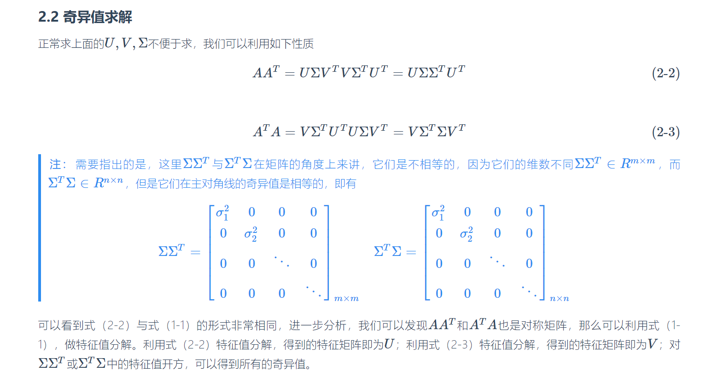
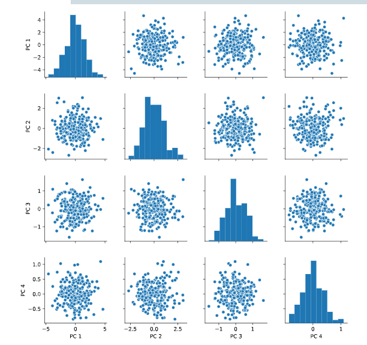

---
output:
  pdf_document: default
  html_document: default
---
# PCA

>PCA(Principal-Component-Analysis)，即主成分分析方法，是一种使用最广泛的数据降维算法。PCA的主要思想是将n维特征映射到k维上，这k维是全新的正交特征也被称为主成分，是在原有n维特征的基础上重新构造出来的k维特征.PCA的工作就是从原始的空间中顺序地找一组相互正交的坐标轴，新的坐标轴的选择与数据本身是密切相关的。其中，第一个新坐标轴选择是原始数据中方差最大的方向，第二个新坐标轴选取是与第一个坐标轴正交的平面中使得方差最大的，第三个轴是与第1,2个轴正交的平面中方差最大的。依次类推，可以得到n个这样的坐标轴。通过这种方式获得的新的坐标轴，我们发现，大部分方差都包含在前面k个坐标轴中，后面的坐标轴所含的方差几乎为0。于是，我们可以忽略余下的坐标轴，只保留前面k个含有绝大部分方差的坐标轴。事实上，这相当于只保留包含绝大部分方差的维度特征，而忽略包含方差几乎为0的特征维度，实现对数据特征的降维处理。[Microstrong0305](https://blog.csdn.net/program_developer/article/details/80632779)

- 通过计算数据矩阵的协方差矩阵，然后得到协方差矩阵的特征值特征向量，选择**特征值最大**(即方差最大)的k个特征所对应的特征向量组成的矩阵。这样就可以将数据矩阵转换到新的空间当中，实现数据特征的降维。

- 方差是衡量数据的离散程度的，因此方差越大数据离散程度越高，PCA的偏好假设数据在低维空间越分散越好。

- 正交平面:可以理解为相互垂直的平面

因此需要搞明白一个问题，为啥特征值大的方差就大？

**协方差**

样本均值：
$\bar{x}=\frac{1}{n} \sum_{i=1}^{N} x_{i}$

样本方差：
$S^{2}=\frac{1}{n-1} \sum_{i=1}^{n}\left(x_{i}-\bar{x}\right)^{2}$

协方差：
$\begin{aligned} \operatorname{Cov}(X, Y) &=E[(X-E(X))(Y-E(Y))] \\ &=\frac{1}{n-1} \sum_{i=1}^{n}\left(x_{i}-\bar{x}\right)\left(y_{i}-\bar{y}\right) \end{aligned}$

(1) 方差的计算公式是针对一维特征，即针对同一特征不同样本的取值来进行计算得到；而协方差则必须要求至少满足二维特征；方差是协方差的特殊情况。

(2) 方差和协方差的除数是n-1,这是为了得到方差和协方差的无偏估计。协方差为正时，说明X和Y是正相关关系；协方差为负时，说明X和Y是负相关关系；协方差为0时，说明X和Y是相互独立。Cov(X,X)就是X的方差。当样本是n维数据时，它们的协方差实际上是协方差矩阵(对称方阵)。

举个三维的栗子

$\operatorname{Cov}(X, Y, Z)=\left[\begin{array}{lll}\operatorname{Cov}(x, x) & \operatorname{Cov}(x, y) & \operatorname{Cov}(x, z) \\ \operatorname{Cov}(y, x) & \operatorname{Cov}(y, y) & \operatorname{Cov}(y, z) \\ \operatorname{Cov}(z, x) & \operatorname{Cov}(z, y) & \operatorname{Cov}(z, z)\end{array}\right]$

**散度矩阵**

$S=\sum_{k=1}^{n}\left(x_{k}-m\right)\left(x_{k}-m\right)^{T}$

$m$是样本均值，散度矩阵就是协方差矩阵乘以（总数据量-1）。因此它们的特征值和特征向量是一样的

## 特征值分解协方差矩阵

**特征值与特征向量**
$A v=\lambda v$

$A$是特征矩阵
$v$是特征向量
$\lambda$是特征向量对应的特征值

**特征值分解矩阵**
就是将矩阵A分解成为正交矩阵
$A=Q \Sigma Q^{-1}$$=Q\left[\begin{array}{cccc}\lambda_{1} & \cdots & \cdots & \cdots \\ \cdots & \lambda_{2} & \cdots & \cdots \\ \cdots & \cdots & \ddots & \cdots \\ \cdots & \cdots & \cdots & \lambda_{m}\end{array}\right] Q^{T}$，
只要将特征向量正交化单位化就会得到一组正交向量

Q是A特征向量组成的矩阵，$\Sigma$是对焦矩阵，是A的特征值组成

## 奇异值分解SVD

>，奇异值可以被看作成一个矩阵的代表值，或者说，奇异值能够代表这个矩阵的信息。当奇异值越大时，它代表的信息越多。因此，我们取前面若干个最大的奇异值，就可以基本上还原出数据本身[参考](https://www.cnblogs.com/endlesscoding/p/10033527.html)


奇异值分解是一个能适用于任意矩阵的一种分解的方法，对于任意矩阵A总是存在一个奇异值分解：$A=U \Sigma V^{T}$

假设A是一个m*n的矩阵，那么得到的U是一个m*m的方阵，U里面的正交向量被称为左奇异向量。Σ是一个m*n的矩阵，Σ除了对角线其它元素都为0，对角线上的元素称为奇异值。$V^{T}$是v的转置矩阵，是一个n*n的矩阵，它里面的正交向量被称为右奇异值向量。而且一般来讲，我们会将Σ上的值按从大到小的顺序排列[Microstrong0305](https://blog.csdn.net/program_developer/article/details/80632779)

样本量很大的时候很有效。实际上，scikit-learn的PCA算法的背后真正的实现就是用的SVD，而不是特征值分解。

```r

```


具体的理论推导过程可以参考[知乎专栏](https://zhuanlan.zhihu.com/p/47858230)


奇异值分解的一个很好的应用是图片压缩

栗子还是sklearn中写好的函数
[sklearn](https://scikit-learn.org/stable/modules/generated/sklearn.decomposition.PCA.html#sklearn.decomposition.PCA)

```python
# Create the scaler
scaler = StandardScaler()
ansur_std = scaler.fit_transform(ansur_df)

# Create the PCA instance and fit and transform the data with pca
pca = PCA()
pc = pca.fit_transform(ansur_std)
pc_df = pd.DataFrame(pc, columns=['PC 1', 'PC 2', 'PC 3', 'PC 4'])

# Create a pairplot of the principal component dataframe
sns.pairplot(pc_df)
plt.show()
# Inspect the explained variance ratio per component
print(pca.explained_variance_ratio_)

<script.py> output:
    [0.61449404 0.19893965 0.06803095 0.03770499 0.03031502 0.0171759
     0.01072762 0.00656681 0.00634743 0.00436015 0.0026586  0.00202617
     0.00065268]

# Print the cumulative sum of the explained variance ratio
print(pca.explained_variance_ratio_.cumsum())

<script.py> output:
    [0.61449404 0.81343368 0.88146463 0.91916962 0.94948464 0.96666054
     0.97738816 0.98395496 0.99030239 0.99466254 0.99732115 0.99934732
     1.        ]
```


```r

```


主成分选择

## 应用

1.EDA中可以结合pipline使用
2.进行图片压缩


