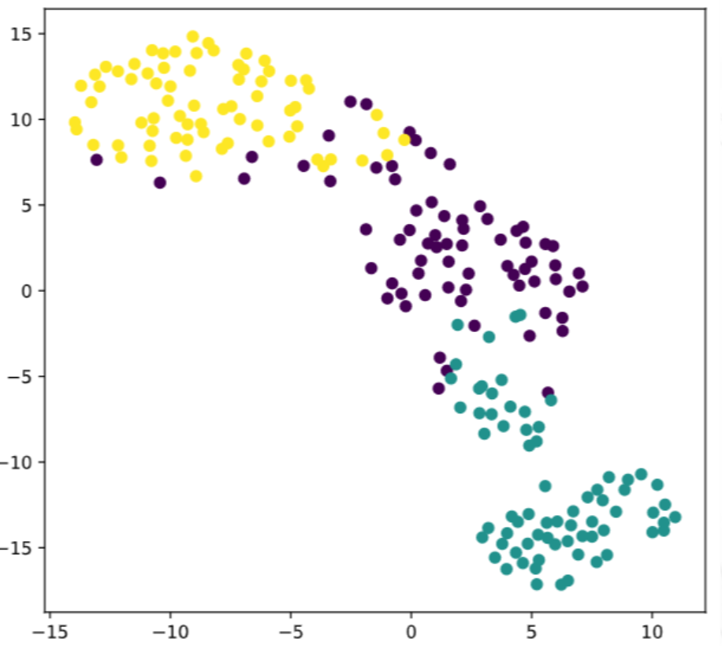

# t-SNE
高维数据可视化方法

>t-SNE is a great technique for visual exploration of high dimensional datasets.

## fit_transform

fit(x,y)传两个参数是有监督学习的算法，
fit(x)传一个参数是无监督学习的算法

- fit(): Method calculates the parameters μ and σ and saves them as internal objects.
解释：简单来说，就是求得训练集X的均值，方差，最大值，最小值,这些训练集X固有的属性。

- transform(): Method using these calculated parameters apply the transformation to a particular dataset.
解释：在fit的基础上，进行标准化，降维，归一化等操作（看具体用的是哪个工具，如PCA，StandardScaler等）。

- fit_transform(): joins the fit() and transform() method for transformation of dataset.
解释：fit_transform是fit和transform的组合，既包括了训练又包含了转换。
transform()和fit_transform()二者的功能都是对数据进行某种统一处理（比如标准化~N(0,1)，将数据缩放(映射)到某个固定区间，归一化，正则化等）

- fit_transform(trainData)对部分数据先拟合fit，找到该part的整体指标，如均值、方差、最大值最小值等等（根据具体转换的目的），然后对该trainData进行转换transform，从而实现数据的标准化、归一化等等。[cnblogs](https://www.cnblogs.com/keye/p/8875128.html)

## 简介


- t-分布领域嵌入算法
- 虽然主打非线性高维数据降维，但是很少用，因为
- 比较适合应用于可视化，测试模型的效果
- 保证在低维上数据的分布与原始特征空间分布的相似性高[知乎](https://www.zhihu.com/question/52022955/answer/387753267)

**因此用来查看分类器的效果更加**

## demo
```python
# Import TSNE
from sklearn.manifold import TSNE 

# Create a TSNE instance: model
model = TSNE(learning_rate=200)

# Apply fit_transform to samples: tsne_features
tsne_features = model.fit_transform(samples)

# Select the 0th feature: xs
xs = tsne_features[:,0]

# Select the 1st feature: ys
ys = tsne_features[:,1]

# Scatter plot, coloring by variety_numbers
plt.scatter(xs,ys,c=variety_numbers)
plt.show()
```


```r

```


